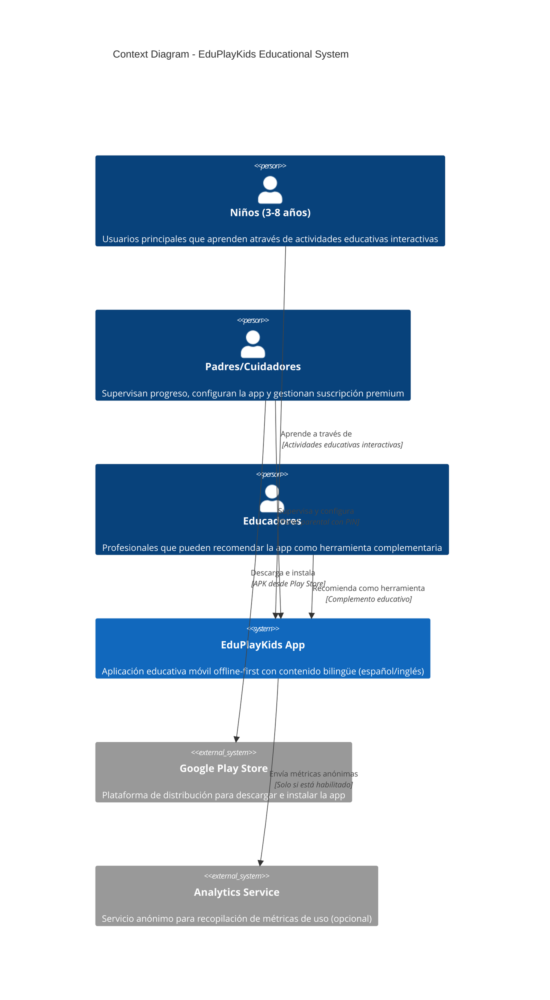
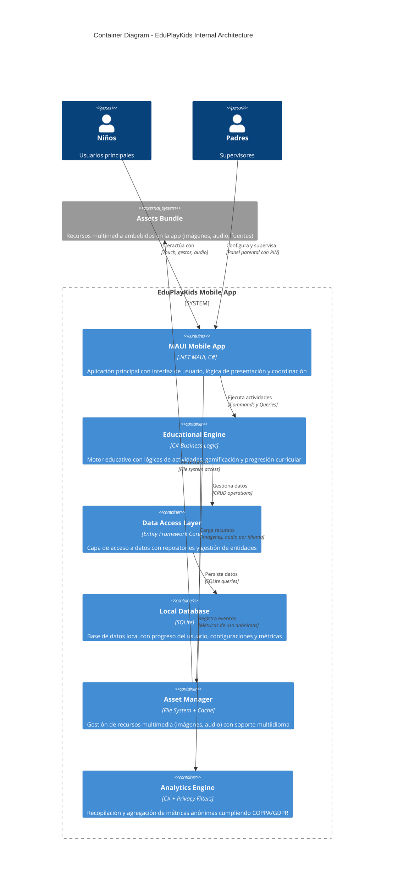
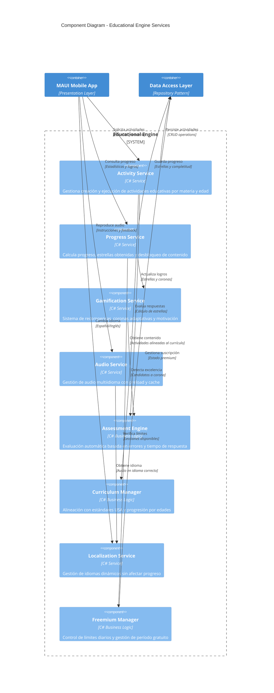
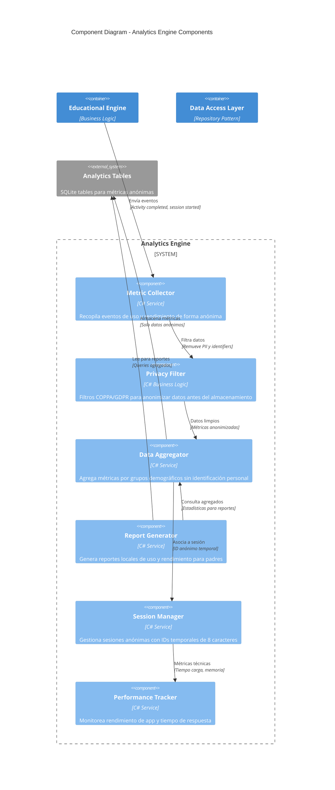
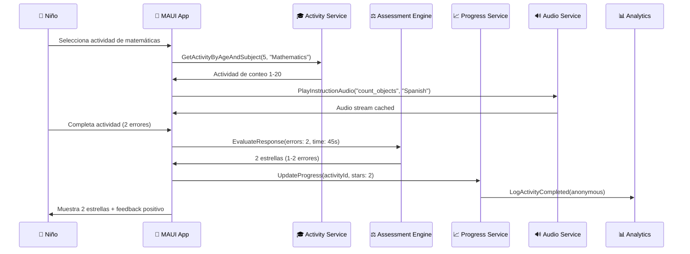
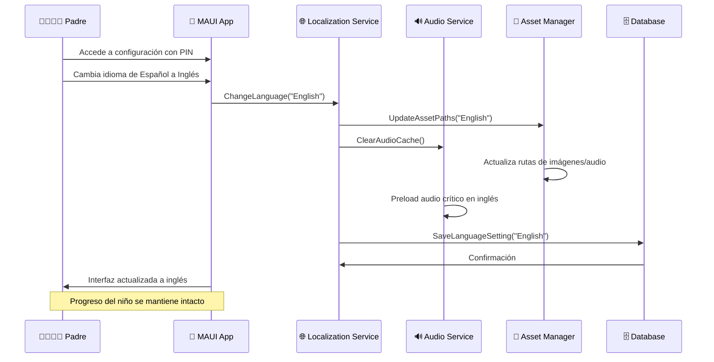
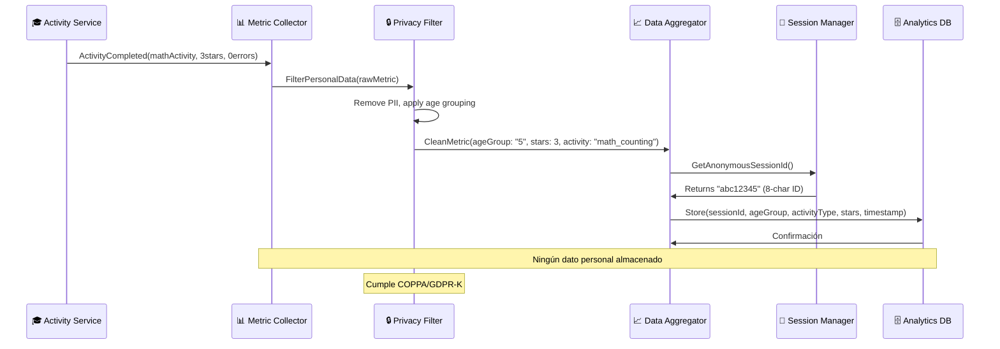
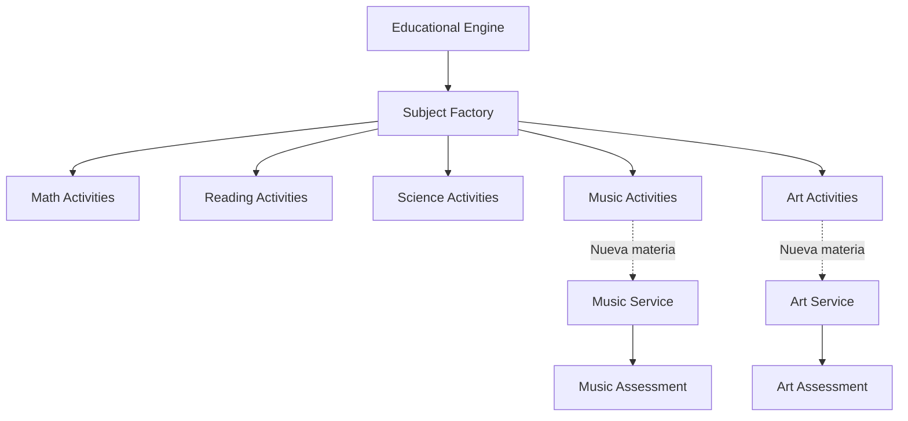
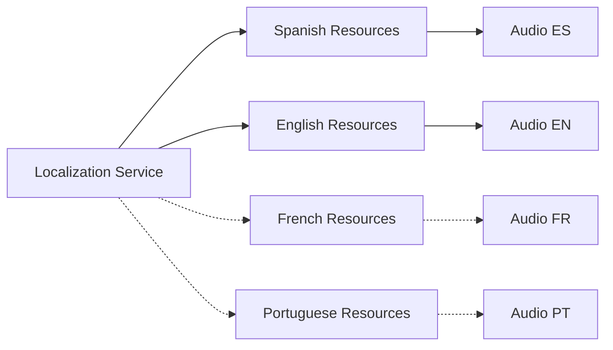

# DIAGRAMAS DE ARQUITECTURA (C4 MODEL)
## EduPlayKids - Aplicación Educativa Móvil

---

### 📋 Información del Documento

| Campo | Detalle |
|-------|---------|
| **Proyecto** | EduPlayKids |
| **Versión** | 1.0 |
| **Fecha** | Septiembre 2024 |
| **Tipo** | Diagramas de Arquitectura C4 Model |
| **Niveles** | Context (L1), Container (L2), Component (L3) |

---

## 🎯 1. INTRODUCCIÓN AL MODELO C4

### 1.1 ¿Qué es el Modelo C4?

El **Modelo C4** (Context, Containers, Components, Code) es un enfoque para visualizar la arquitectura de software a través de diferentes niveles de abstracción:

- **📊 Level 1 - Context**: Vista de alto nivel del sistema y sus usuarios
- **📦 Level 2 - Container**: Aplicaciones y almacenes de datos principales
- **⚙️ Level 3 - Component**: Componentes dentro de cada contenedor
- **💻 Level 4 - Code**: Clases y interfaces (implementación detallada)

### 1.2 Convenciones de Diagramas

**Colores y Formas:**
- 🟦 **Azul**: Sistemas y contenedores internos
- 🟨 **Amarillo**: Usuarios y personas
- 🟩 **Verde**: Sistemas externos
- 🟥 **Rojo**: Componentes críticos o de seguridad

---

## 📊 2. NIVEL 1 - CONTEXT DIAGRAM

### 2.1 Ecosistema Completo de EduPlayKids

### 2.2 Descripción del Contexto

#### **👥 Actores Principales**

- **🧒 Niños (3-8 años)**
  - **Rol**: Usuarios principales de la aplicación
  - **Interacción**: Realizan actividades educativas, juegos interactivos
  - **Necesidades**: Interfaz intuitiva, feedback inmediato, experiencia divertida

- **👨‍👩‍👧‍👦 Padres/Cuidadores**
  - **Rol**: Supervisores y administradores
  - **Interacción**: Configuran perfiles, monitorean progreso, gestionan premium
  - **Necesidades**: Control parental, estadísticas detalladas, privacidad

- **👩‍🏫 Educadores**
  - **Rol**: Recomendadores y validadores del contenido
  - **Interacción**: Evalúan la aplicación como herramienta educativa
  - **Necesidades**: Alineación curricular, reportes de progreso

#### **🔗 Relaciones Externas**

- **🏪 Google Play Store**: Único punto de distribución
- **📊 Analytics Service**: Recopilación opcional de métricas anónimas

---

## 📦 3. NIVEL 2 - CONTAINER DIAGRAM

### 3.1 Arquitectura de Contenedores

### 3.2 Descripción de Contenedores

#### **📱 MAUI Mobile App**
- **Tecnología**: .NET MAUI (Multi-platform App UI)
- **Responsabilidad**: Interfaz de usuario, navegación, MVVM binding
- **Funciones Clave**: 
  - Gestión de vistas y ViewModels
  - Binding de datos bidireccional
  - Navegación entre pantallas
  - Gestión de comandos de usuario

#### **🎓 Educational Engine**
- **Tecnología**: C# Business Logic Layer
- **Responsabilidad**: Lógica educativa y gamificación
- **Funciones Clave**:
  - Generación de actividades por edad
  - Sistema de calificación por estrellas
  - Algoritmo de coronas adaptativas
  - Progresión curricular

#### **🗄️ Data Access Layer**
- **Tecnología**: Entity Framework Core
- **Responsabilidad**: Acceso y persistencia de datos
- **Funciones Clave**:
  - Repository pattern
  - Migrations automáticas
  - Relaciones entre entidades
  - Transacciones y concurrencia

#### **📊 SQLite Database**
- **Tecnología**: SQLite (embedded database)
- **Responsabilidad**: Almacenamiento local offline
- **Funciones Clave**:
  - Progreso del usuario
  - Configuraciones de app
  - Métricas anónimas
  - Cache de datos

#### **🎨 Asset Manager**
- **Tecnología**: File System + Memory Cache
- **Responsabilidad**: Gestión de recursos multimedia
- **Funciones Clave**:
  - Cache inteligente de assets
  - Soporte multiidioma
  - Optimización de memoria
  - Preload de recursos críticos

#### **📈 Analytics Engine**
- **Tecnología**: C# + Privacy Filters
- **Responsabilidad**: Métricas anónimas y reportes
- **Funciones Clave**:
  - Recopilación de métricas sin PII
  - Filtros de privacidad (COPPA/GDPR)
  - Agregación de datos
  - Reportes locales

---

## ⚙️ 4. NIVEL 3 - COMPONENT DIAGRAM

### 4.1 Componentes del Educational Engine

### 4.2 Componentes del Analytics Engine

### 4.3 Descripción de Componentes Clave

#### **🎓 Servicios Educativos**

**Activity Service**
- **Funciones**: Crea y gestiona actividades por materia y edad
- **Input**: Edad del niño, materia seleccionada, nivel de dificultad
- **Output**: Actividad personalizada con contenido apropiado
- **Dependencias**: Curriculum Manager, Assessment Engine

**Progress Service**
- **Funciones**: Calcula progreso, desbloquea contenido, gestiona estadísticas
- **Input**: Resultado de actividades, tiempo invertido
- **Output**: Progreso actualizado, contenido desbloqueado
- **Dependencias**: Gamification Service, Data Layer

**Gamification Service**
- **Funciones**: Sistema de estrellas, coronas, logros y motivación
- **Input**: Rendimiento en actividades, patrones de uso
- **Output**: Recompensas, desafíos adicionales, feedback motivacional
- **Dependencias**: Assessment Engine, Progress Service

#### **🔊 Servicios Multimedia**

**Audio Service**
- **Funciones**: Gestiona reproducción de audio multiidioma
- **Input**: Clave de audio, idioma seleccionado
- **Output**: Stream de audio con cache inteligente
- **Dependencias**: Localization Service, Asset Manager

**Localization Service**
- **Funciones**: Cambio dinámico de idioma sin afectar progreso
- **Input**: Idioma seleccionado (español/inglés)
- **Output**: Contenido localizado, rutas de assets
- **Dependencias**: Asset Manager

#### **📊 Servicios de Analytics**

**Metric Collector**
- **Funciones**: Recopila eventos de uso de forma anónima
- **Input**: Eventos de aplicación (activity_completed, session_start)
- **Output**: Métricas estructuradas sin PII
- **Dependencias**: Privacy Filter

**Privacy Filter**
- **Funciones**: Filtros COPPA/GDPR para anonimización
- **Input**: Datos brutos con potencial PII
- **Output**: Datos completamente anónimos
- **Dependencias**: Data Aggregator

**Report Generator**
- **Funciones**: Genera reportes locales para padres
- **Input**: Métricas agregadas por período de tiempo
- **Output**: Reportes visuales de progreso y uso
- **Dependencias**: Data Aggregator, Local Database

---

## 🔄 5. FLUJOS DE DATOS PRINCIPALES

### 5.1 Flujo de Actividad Educativa

### 5.2 Flujo de Cambio de Idioma

### 5.3 Flujo de Analytics Anónimos

---

## 📊 6. PATRONES ARQUITECTÓNICOS APLICADOS

### 6.1 Patrones de Diseño Utilizados

#### **🏛️ Repository Pattern**
- **Propósito**: Abstracción del acceso a datos
- **Implementación**: Generic Repository + Specific Repositories
- **Beneficio**: Testabilidad y separación de concerns

#### **🎯 Command Pattern**
- **Propósito**: Encapsular operaciones como objetos
- **Implementación**: ICommand en ViewModels
- **Beneficio**: Desacoplamiento y undo/redo capability

#### **🔔 Observer Pattern**
- **Propósito**: Notificación de cambios de estado
- **Implementación**: INotifyPropertyChanged en ViewModels
- **Beneficio**: Data binding reactivo en MAUI

#### **🏗️ Factory Pattern**
- **Propósito**: Creación de actividades educativas
- **Implementación**: ActivityFactory por materia y edad
- **Beneficio**: Extensibilidad para nuevas actividades

#### **🛡️ Strategy Pattern**
- **Propósito**: Algoritmos de evaluación intercambiables
- **Implementación**: IAssessmentStrategy por tipo de actividad
- **Beneficio**: Flexibilidad en criterios de evaluación

### 6.2 Principios SOLID Aplicados

#### **S - Single Responsibility Principle**
- Cada servicio tiene una responsabilidad específica
- ActivityService solo gestiona actividades
- ProgressService solo maneja progreso

#### **O - Open/Closed Principle**
- Nuevas actividades se agregan sin modificar código existente
- ActivityFactory extensible para nuevas materias

#### **L - Liskov Substitution Principle**
- IRepository<T> puede ser sustituido por implementaciones específicas
- IAssessmentStrategy permite diferentes algoritmos de evaluación

#### **I - Interface Segregation Principle**
- Interfaces específicas en lugar de una monolítica
- IAudioService, IProgressService, etc.

#### **D - Dependency Inversion Principle**
- Capas superiores dependen de abstracciones
- Educational Engine depende de IRepository, no de implementación SQLite

---

## 🚀 7. CONSIDERACIONES DE ESCALABILIDAD

### 7.1 Escalabilidad Horizontal

#### **📚 Nuevas Materias Educativas**

#### **🌍 Nuevos Idiomas**

### 7.2 Escalabilidad Vertical

#### **⚡ Performance Optimizations**
- **Lazy Loading**: Carga bajo demanda de assets pesados
- **Background Processing**: Procesamiento de analytics en background threads
- **Memory Management**: Cache inteligente con límites de memoria
- **Database Optimization**: Índices en consultas frecuentes

#### **📊 Data Growth Management**
- **Data Retention**: Políticas de retención para métricas anónimas
- **Database Partitioning**: Separación por períodos de tiempo
- **Compression**: Compresión de assets multimedia
- **Purge Strategies**: Limpieza automática de datos obsoletos

---

*Los diagramas C4 Model proporcionan una vista completa y estructurada de la arquitectura de EduPlayKids, facilitando la comprensión del sistema a diferentes niveles de abstracción y supporting future development and maintenance.*