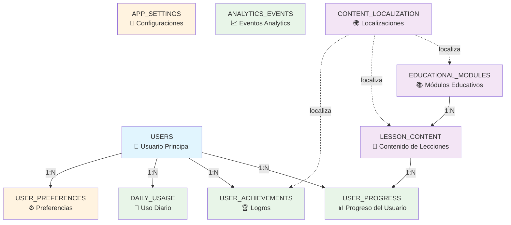

# Diccionario de Datos - EduPlayKids

## 1. Resumen Ejecutivo

Este documento proporciona la documentación completa de todos los campos, tipos de datos, restricciones y relaciones de la base de datos SQLite de EduPlayKids. Sirve como referencia técnica para desarrolladores, testers y mantenimiento de la aplicación.

## 2. Convenciones y Estándares

### 2.1 Convenciones de Nomenclatura

**Tablas**: snake_case, plural (ej: `user_progress`, `educational_modules`)
**Columnas**: snake_case, singular (ej: `user_id`, `created_at`)
**Índices**: Prefijo `idx_` + tabla + campos (ej: `idx_users_name`)
**Foreign Keys**: Nombre de tabla referenciada + `_id` (ej: `user_id`, `lesson_id`)

### 2.2 Tipos de Datos Estándar

| Tipo SQLite | Uso Principal | Ejemplo |
|-------------|---------------|---------|
| INTEGER | IDs, contadores, flags booleanos | `id`, `age`, `is_premium_user` |
| TEXT | Cadenas de texto, JSON | `name`, `preferences_json` |
| DATETIME | Timestamps | `created_at`, `completed_at` |
| DATE | Fechas sin hora | `usage_date` |
| TIME | Duración temporal | `estimated_duration` |
| BOOLEAN | Valores verdadero/falso | `is_active`, `is_completed` |

### 2.3 Campos Estándar de Auditoría

Todas las tablas principales incluyen:
- `created_at DATETIME DEFAULT CURRENT_TIMESTAMP`
- `updated_at DATETIME DEFAULT CURRENT_TIMESTAMP` (con trigger)
- `id INTEGER PRIMARY KEY AUTOINCREMENT`

## 3. Diccionario Detallado por Tabla

### 3.1 Tabla: `users`

**Propósito**: Almacena información de todos los usuarios (niños) que utilizan la aplicación en el dispositivo.

| Campo | Tipo | Null | Default | Restricciones | Descripción |
|-------|------|------|---------|---------------|-------------|
| `id` | INTEGER | NO | AUTOINCREMENT | PRIMARY KEY | Identificador único del usuario |
| `name` | TEXT | NO | - | CHECK(length(name) <= 50) | Nombre del niño, máximo 50 caracteres |
| `age` | INTEGER | NO | - | CHECK(age >= 3 AND age <= 8) | Edad del niño entre 3 y 8 años |
| `preferred_language` | TEXT | NO | 'es' | CHECK IN ('es', 'en') | Idioma preferido: español o inglés |
| `is_premium_user` | BOOLEAN | NO | 0 | - | Indica si el usuario tiene acceso premium |
| `premium_expiry_date` | DATETIME | SÍ | NULL | - | Fecha de expiración del acceso premium |
| `purchase_transaction_id` | TEXT | SÍ | NULL | - | ID de transacción de compra premium |
| `purchase_date` | DATETIME | SÍ | NULL | - | Fecha de compra premium |
| `created_at` | DATETIME | NO | CURRENT_TIMESTAMP | - | Timestamp de creación del registro |
| `last_active_at` | DATETIME | NO | CURRENT_TIMESTAMP | - | Último timestamp de actividad |
| `updated_at` | DATETIME | NO | CURRENT_TIMESTAMP | - | Timestamp de última actualización |

**Índices**:
- `idx_users_name`: Búsqueda rápida por nombre
- `idx_users_last_active`: Ordenamiento por última actividad
- `idx_users_premium`: Filtrado por estado premium

**Relaciones**:
- `user_progress.user_id` → `users.id` (1:N)
- `user_achievements.user_id` → `users.id` (1:N)
- `daily_usage.user_id` → `users.id` (1:N)

### 3.2 Tabla: `educational_modules`

**Propósito**: Define los módulos principales del currículum educativo (Matemáticas, Lectura, Ciencias, etc.).

| Campo | Tipo | Null | Default | Restricciones | Descripción |
|-------|------|------|---------|---------------|-------------|
| `id` | INTEGER | NO | AUTOINCREMENT | PRIMARY KEY | Identificador único del módulo |
| `module_code` | TEXT | NO | - | UNIQUE | Código único del módulo (ej: "MATH_BASIC") |
| `name_key_en` | TEXT | NO | - | - | Clave de localización para nombre en inglés |
| `name_key_es` | TEXT | NO | - | - | Clave de localización para nombre en español |
| `description_key_en` | TEXT | SÍ | NULL | - | Clave de localización para descripción en inglés |
| `description_key_es` | TEXT | SÍ | NULL | - | Clave de localización para descripción en español |
| `sort_order` | INTEGER | NO | - | - | Orden de presentación en la UI |
| `min_age` | INTEGER | NO | - | CHECK(min_age >= 3) | Edad mínima recomendada |
| `max_age` | INTEGER | NO | - | CHECK(max_age <= 8) | Edad máxima recomendada |
| `curriculum_standard` | TEXT | SÍ | NULL | - | Estándar educativo (Common Core, etc.) |
| `icon_path` | TEXT | SÍ | NULL | - | Ruta relativa al icono del módulo |
| `is_active` | BOOLEAN | NO | 1 | - | Indica si el módulo está activo |
| `created_at` | DATETIME | NO | CURRENT_TIMESTAMP | - | Timestamp de creación |
| `updated_at` | DATETIME | NO | CURRENT_TIMESTAMP | - | Timestamp de última actualización |

**Índices**:
- `idx_modules_code`: Búsqueda por código único
- `idx_modules_active_sort`: Módulos activos ordenados
- `idx_modules_age_range`: Filtrado por rango de edad

**Relaciones**:
- `lesson_content.module_id` → `educational_modules.id` (1:N)

### 3.3 Tabla: `lesson_content`

**Propósito**: Almacena el contenido educativo detallado de cada lección individual.

| Campo | Tipo | Null | Default | Restricciones | Descripción |
|-------|------|------|---------|---------------|-------------|
| `id` | INTEGER | NO | AUTOINCREMENT | PRIMARY KEY | Identificador único de la lección |
| `lesson_code` | TEXT | NO | - | UNIQUE | Código único de lección (ej: "MATH001_L01") |
| `module_id` | INTEGER | NO | - | FK educational_modules(id) | Referencia al módulo padre |
| `title_key_en` | TEXT | NO | - | - | Clave de localización para título en inglés |
| `title_key_es` | TEXT | NO | - | - | Clave de localización para título en español |
| `instructions_key_en` | TEXT | SÍ | NULL | - | Clave para instrucciones en inglés |
| `instructions_key_es` | TEXT | SÍ | NULL | - | Clave para instrucciones en español |
| `sort_order` | INTEGER | NO | - | - | Orden de secuencia en el módulo |
| `difficulty_level` | INTEGER | NO | - | CHECK(1 <= difficulty_level <= 5) | Nivel de dificultad 1-5 |
| `estimated_duration` | INTEGER | NO | - | - | Duración estimada en segundos |
| `interactive_content_json` | TEXT | SÍ | NULL | - | Contenido interactivo en formato JSON |
| `audio_assets_en` | TEXT | SÍ | NULL | - | Array JSON de rutas de audio en inglés |
| `audio_assets_es` | TEXT | SÍ | NULL | - | Array JSON de rutas de audio en español |
| `image_assets` | TEXT | SÍ | NULL | - | Array JSON de rutas de imágenes |
| `prerequisites` | TEXT | SÍ | NULL | - | Array JSON de lesson_codes prerequisitos |
| `learning_objectives` | TEXT | SÍ | NULL | - | Array JSON de objetivos de aprendizaje |
| `is_active` | BOOLEAN | NO | 1 | - | Indica si la lección está activa |
| `created_at` | DATETIME | NO | CURRENT_TIMESTAMP | - | Timestamp de creación |
| `updated_at` | DATETIME | NO | CURRENT_TIMESTAMP | - | Timestamp de última actualización |

**Índices**:
- `idx_lessons_code`: Búsqueda por código único
- `idx_lessons_module_sort`: Lecciones por módulo ordenadas
- `idx_lessons_difficulty`: Filtrado por dificultad
- `idx_lessons_active`: Filtrado por estado activo

**Relaciones**:
- `lesson_content.module_id` → `educational_modules.id` (N:1)
- `user_progress.lesson_id` → `lesson_content.id` (1:N)

### 3.4 Tabla: `user_progress`

**Propósito**: Rastrea el progreso detallado de cada usuario en cada lección completada o iniciada.

| Campo | Tipo | Null | Default | Restricciones | Descripción |
|-------|------|------|---------|---------------|-------------|
| `id` | INTEGER | NO | AUTOINCREMENT | PRIMARY KEY | Identificador único del registro de progreso |
| `user_id` | INTEGER | NO | - | FK users(id) CASCADE | Referencia al usuario |
| `lesson_id` | INTEGER | NO | - | FK lesson_content(id) | Referencia a la lección |
| `started_at` | DATETIME | SÍ | NULL | - | Timestamp de inicio de la lección |
| `completed_at` | DATETIME | SÍ | NULL | - | Timestamp de finalización |
| `attempt_count` | INTEGER | NO | 1 | - | Número de intentos realizados |
| `error_count` | INTEGER | NO | 0 | - | Cantidad de errores cometidos |
| `hint_count` | INTEGER | NO | 0 | - | Cantidad de pistas solicitadas |
| `completion_time` | INTEGER | SÍ | NULL | - | Tiempo de completado en segundos |
| `star_rating` | INTEGER | SÍ | NULL | CHECK(1 <= star_rating <= 3) | Calificación 1-3 estrellas |
| `answers_json` | TEXT | SÍ | NULL | - | Respuestas detalladas en formato JSON |
| `session_data` | TEXT | SÍ | NULL | - | Datos de sesión para continuidad |
| `is_completed` | BOOLEAN | NO | 0 | - | Indica si la lección fue completada |
| `created_at` | DATETIME | NO | CURRENT_TIMESTAMP | - | Timestamp de creación |
| `updated_at` | DATETIME | NO | CURRENT_TIMESTAMP | - | Timestamp de última actualización |

**Restricciones Únicas**:
- `UNIQUE(user_id, lesson_id)`: Un registro de progreso por usuario por lección

**Índices**:
- `idx_progress_user_completed`: Progreso por usuario ordenado por fecha
- `idx_progress_user_lesson`: Búsqueda específica usuario-lección
- `idx_progress_completed`: Filtrado por estado completado
- `idx_progress_star_rating`: Ordenamiento por calificación

**Relaciones**:
- `user_progress.user_id` → `users.id` (N:1)
- `user_progress.lesson_id` → `lesson_content.id` (N:1)

### 3.5 Tabla: `user_achievements`

**Propósito**: Almacena los logros y reconocimientos ganados por cada usuario.

| Campo | Tipo | Null | Default | Restricciones | Descripción |
|-------|------|------|---------|---------------|-------------|
| `id` | INTEGER | NO | AUTOINCREMENT | PRIMARY KEY | Identificador único del logro |
| `user_id` | INTEGER | NO | - | FK users(id) CASCADE | Referencia al usuario |
| `achievement_type` | TEXT | NO | - | - | Tipo de logro (lesson_streak, perfect_score, etc.) |
| `achievement_code` | TEXT | NO | - | - | Código único del logro |
| `title_key_en` | TEXT | NO | - | - | Clave de localización para título en inglés |
| `title_key_es` | TEXT | NO | - | - | Clave de localización para título en español |
| `description_key_en` | TEXT | SÍ | NULL | - | Clave para descripción en inglés |
| `description_key_es` | TEXT | SÍ | NULL | - | Clave para descripción en español |
| `icon_path` | TEXT | SÍ | NULL | - | Ruta relativa al icono del logro |
| `metadata_json` | TEXT | SÍ | NULL | - | Datos específicos del logro en JSON |
| `earned_at` | DATETIME | NO | CURRENT_TIMESTAMP | - | Timestamp cuando se ganó el logro |
| `created_at` | DATETIME | NO | CURRENT_TIMESTAMP | - | Timestamp de creación del registro |

**Restricciones Únicas**:
- `UNIQUE(user_id, achievement_code)`: Un logro específico por usuario

**Índices**:
- `idx_achievements_user_earned`: Logros por usuario ordenados por fecha
- `idx_achievements_type`: Filtrado por tipo de logro
- `idx_achievements_code`: Búsqueda por código de logro

**Relaciones**:
- `user_achievements.user_id` → `users.id` (N:1)

### 3.6 Tabla: `daily_usage`

**Propósito**: Rastrea estadísticas de uso diario por usuario para implementar límites freemium y analytics.

| Campo | Tipo | Null | Default | Restricciones | Descripción |
|-------|------|------|---------|---------------|-------------|
| `id` | INTEGER | NO | AUTOINCREMENT | PRIMARY KEY | Identificador único del registro diario |
| `user_id` | INTEGER | NO | - | FK users(id) CASCADE | Referencia al usuario |
| `usage_date` | DATE | NO | - | - | Fecha del uso (YYYY-MM-DD) |
| `lessons_completed` | INTEGER | NO | 0 | - | Número de lecciones completadas ese día |
| `total_time_spent` | INTEGER | NO | 0 | - | Tiempo total invertido en segundos |
| `session_count` | INTEGER | NO | 0 | - | Número de sesiones iniciadas |
| `first_session_at` | DATETIME | SÍ | NULL | - | Timestamp de primera sesión del día |
| `last_session_at` | DATETIME | SÍ | NULL | - | Timestamp de última sesión del día |
| `created_at` | DATETIME | NO | CURRENT_TIMESTAMP | - | Timestamp de creación |
| `updated_at` | DATETIME | NO | CURRENT_TIMESTAMP | - | Timestamp de última actualización |

**Restricciones Únicas**:
- `UNIQUE(user_id, usage_date)`: Un registro por usuario por día

**Índices**:
- `idx_daily_usage_user_date`: Uso por usuario ordenado por fecha
- `idx_daily_usage_date`: Filtrado por fecha específica

**Relaciones**:
- `daily_usage.user_id` → `users.id` (N:1)

### 3.7 Tabla: `user_preferences`

**Propósito**: Almacena preferencias configurables específicas de cada usuario.

| Campo | Tipo | Null | Default | Restricciones | Descripción |
|-------|------|------|---------|---------------|-------------|
| `id` | INTEGER | NO | AUTOINCREMENT | PRIMARY KEY | Identificador único de la preferencia |
| `user_id` | INTEGER | NO | - | FK users(id) CASCADE | Referencia al usuario |
| `preference_key` | TEXT | NO | - | - | Clave de la preferencia |
| `preference_value` | TEXT | NO | - | - | Valor de la preferencia (como string) |
| `data_type` | TEXT | NO | 'string' | CHECK IN tipos | Tipo de dato (string, integer, boolean, json) |
| `created_at` | DATETIME | NO | CURRENT_TIMESTAMP | - | Timestamp de creación |
| `updated_at` | DATETIME | NO | CURRENT_TIMESTAMP | - | Timestamp de última actualización |

**Restricciones Únicas**:
- `UNIQUE(user_id, preference_key)`: Una preferencia por clave por usuario

**Índices**:
- `idx_preferences_user_key`: Búsqueda rápida por usuario y clave

**Relaciones**:
- `user_preferences.user_id` → `users.id` (N:1)

**Ejemplos de Preferencias**:
- `sound_volume`: "0.8" (float as string)
- `favorite_character`: "bear" (string)
- `difficulty_override`: "3" (integer as string)

### 3.8 Tabla: `app_settings`

**Propósito**: Configuraciones globales de la aplicación, tanto para usuario como para sistema.

| Campo | Tipo | Null | Default | Restricciones | Descripción |
|-------|------|------|---------|---------------|-------------|
| `id` | INTEGER | NO | AUTOINCREMENT | PRIMARY KEY | Identificador único de la configuración |
| `setting_key` | TEXT | NO | - | UNIQUE | Clave única de la configuración |
| `setting_value` | TEXT | NO | - | - | Valor de la configuración |
| `description` | TEXT | SÍ | NULL | - | Descripción legible de la configuración |
| `data_type` | TEXT | NO | 'string' | CHECK IN tipos | Tipo de dato |
| `is_user_configurable` | BOOLEAN | NO | 0 | - | Si el usuario puede modificarlo |
| `created_at` | DATETIME | NO | CURRENT_TIMESTAMP | - | Timestamp de creación |
| `updated_at` | DATETIME | NO | CURRENT_TIMESTAMP | - | Timestamp de última actualización |

**Índices**:
- `idx_settings_key`: Búsqueda única por clave

**Ejemplos de Settings**:
- `app_version`: "1.0.0" (system)
- `daily_lesson_limit_free`: "10" (system)
- `analytics_enabled`: "0" (user configurable)

### 3.9 Tabla: `analytics_events`

**Propósito**: Almacena eventos de analytics anónimos para análisis de uso cumpliendo COPPA/GDPR.

| Campo | Tipo | Null | Default | Restricciones | Descripción |
|-------|------|------|---------|---------------|-------------|
| `id` | INTEGER | NO | AUTOINCREMENT | PRIMARY KEY | Identificador único del evento |
| `session_id` | TEXT | NO | - | - | ID anónimo de sesión (rota cada launch) |
| `event_name` | TEXT | NO | - | - | Nombre del evento (lesson_completed, etc.) |
| `event_category` | TEXT | NO | - | - | Categoría (education, navigation, system) |
| `parameters_json` | TEXT | SÍ | NULL | - | Parámetros anónimos del evento en JSON |
| `event_timestamp` | DATETIME | NO | CURRENT_TIMESTAMP | - | Timestamp del evento |
| `is_synced` | BOOLEAN | NO | 0 | - | Indica si fue enviado al servidor |
| `synced_at` | DATETIME | SÍ | NULL | - | Timestamp de sincronización |
| `created_at` | DATETIME | NO | CURRENT_TIMESTAMP | - | Timestamp de creación del registro |

**Índices**:
- `idx_analytics_sync`: Eventos pendientes de sincronización
- `idx_analytics_session`: Eventos por sesión
- `idx_analytics_category`: Filtrado por categoría

**Ejemplo de Evento**:
```json
{
  "session_id": "anon_sess_123456",
  "event_name": "lesson_completed",
  "event_category": "education",
  "parameters_json": "{\"lesson_module\":\"math\",\"difficulty\":2,\"error_count\":1,\"completion_time_sec\":120}"
}
```

### 3.10 Tabla: `content_localization`

**Propósito**: Centraliza todas las cadenas de texto localizadas para contenido bilingüe.

| Campo | Tipo | Null | Default | Restricciones | Descripción |
|-------|------|------|---------|---------------|-------------|
| `id` | INTEGER | NO | AUTOINCREMENT | PRIMARY KEY | Identificador único de la localización |
| `localization_key` | TEXT | NO | - | - | Clave única de localización |
| `language` | TEXT | NO | - | CHECK IN ('es', 'en') | Código de idioma |
| `localized_text` | TEXT | NO | - | - | Texto traducido |
| `context` | TEXT | SÍ | NULL | - | Contexto para el traductor |
| `created_at` | DATETIME | NO | CURRENT_TIMESTAMP | - | Timestamp de creación |
| `updated_at` | DATETIME | NO | CURRENT_TIMESTAMP | - | Timestamp de última actualización |

**Restricciones Únicas**:
- `UNIQUE(localization_key, language)`: Una traducción por clave por idioma

**Índices**:
- `idx_localization_key_lang`: Búsqueda rápida por clave e idioma
- `idx_localization_lang`: Filtrado por idioma

**Ejemplo**:
```sql
localization_key: "ui.welcome"
language: "es"
localized_text: "¡Bienvenido a EduPlayKids!"
context: "Welcome message on main screen"
```

## 4. Relaciones y Dependencias

### 4.1 Diagrama de Dependencias



### 4.2 Integridad Referencial

**Cascading Deletes**:
- `users` → `user_progress`: CASCADE (eliminar progreso al eliminar usuario)
- `users` → `user_achievements`: CASCADE (eliminar logros al eliminar usuario)
- `users` → `daily_usage`: CASCADE (eliminar estadísticas al eliminar usuario)
- `users` → `user_preferences`: CASCADE (eliminar preferencias al eliminar usuario)

**Protected Relationships**:
- `educational_modules` → `lesson_content`: RESTRICT (no eliminar módulo con lecciones)
- `lesson_content` → `user_progress`: RESTRICT (no eliminar lección con progreso)

## 5. Validaciones y Constraints

### 5.1 Constraints de Dominio

**Ranges de Edad**:
```sql
CHECK(age >= 3 AND age <= 8)  -- users.age
CHECK(min_age >= 3)           -- educational_modules.min_age
CHECK(max_age <= 8)           -- educational_modules.max_age
CHECK(max_age >= min_age)     -- educational_modules
```

**Enumeraciones**:
```sql
CHECK(preferred_language IN ('es', 'en'))           -- users.preferred_language
CHECK(difficulty_level >= 1 AND difficulty_level <= 5)  -- lesson_content.difficulty_level
CHECK(star_rating >= 1 AND star_rating <= 3)        -- user_progress.star_rating
CHECK(data_type IN ('string', 'integer', 'boolean', 'json'))  -- app_settings, user_preferences
```

**Longitudes de Texto**:
```sql
CHECK(length(name) <= 50)     -- users.name
```

### 5.2 Business Logic Constraints

**Freemium Logic** (implementado en aplicación):
- Usuarios no premium limitados a 10 lecciones por día
- Trial de 3 días desde instalación
- Verificación de premium_expiry_date

**Educational Logic**:
- Prerequisitos verificados antes de permitir acceso a lección
- Progresión secuencial dentro de módulos
- Algoritmo adaptativo basado en performance

## 6. Índices de Performance

### 6.1 Índices Críticos

**Para Login y User Management**:
```sql
CREATE INDEX idx_users_name ON users(name);
CREATE INDEX idx_users_last_active ON users(last_active_at DESC);
```

**Para Progreso y Learning Path**:
```sql
CREATE INDEX idx_progress_user_completed ON user_progress(user_id, completed_at DESC);
CREATE INDEX idx_progress_user_lesson ON user_progress(user_id, lesson_id);
```

**Para Contenido y Navigation**:
```sql
CREATE INDEX idx_lessons_module_sort ON lesson_content(module_id, sort_order);
CREATE INDEX idx_modules_active_sort ON educational_modules(is_active, sort_order);
```

**Para Analytics y Reporting**:
```sql
CREATE INDEX idx_daily_usage_user_date ON daily_usage(user_id, usage_date DESC);
CREATE INDEX idx_analytics_sync ON analytics_events(is_synced, event_timestamp);
```

### 6.2 Índices de Integridad

**Foreign Key Indices** (automáticos en SQLite con PRAGMA foreign_keys = ON):
- `user_progress.user_id`
- `user_progress.lesson_id`
- `lesson_content.module_id`
- `user_achievements.user_id`
- `daily_usage.user_id`
- `user_preferences.user_id`

## 7. Consideraciones de Almacenamiento

### 7.1 Estimaciones de Tamaño

**Por Usuario (1 año de uso)**:
- `user_progress`: ~500 registros × 200 bytes = 100KB
- `daily_usage`: 365 registros × 100 bytes = 36KB  
- `user_achievements`: ~50 registros × 150 bytes = 7.5KB
- `user_preferences`: ~20 registros × 80 bytes = 1.6KB
- **Total por usuario**: ~145KB

**Contenido Base**:
- `educational_modules`: ~10 registros × 200 bytes = 2KB
- `lesson_content`: ~200 registros × 500 bytes = 100KB
- `content_localization`: ~1000 registros × 100 bytes = 100KB
- `app_settings`: ~50 registros × 100 bytes = 5KB
- **Total contenido**: ~207KB

**Analytics (30 días retention)**:
- `analytics_events`: ~1000 eventos × 200 bytes = 200KB

**Estimación Total Database**:
- 1 usuario: ~552KB
- 3 usuarios: ~642KB
- 5 usuarios: ~732KB

### 7.2 Estrategias de Optimización

**Compresión de JSON**:
- JSON minificado en producción
- Compresión gzip para `interactive_content_json`

**Data Archival**:
- Analytics > 30 días → archivo local
- Progress > 2 años → compresión/archival

**Indexing Strategy**:
- Partial indexes para datos activos
- Composite indexes para queries frecuentes

## 8. Seguridad y Privacy

### 8.1 Datos Sensibles

**PII Mínimo**:
- Solo `users.name` (first name únicamente)
- No apellidos, no emails, no direcciones
- Edad como rango, no fecha de nacimiento exacta

**Analytics Privacy**:
- `session_id` rota cada launch de app
- No user_id en analytics_events
- Parámetros anónimos únicamente

### 8.2 Encryption (Futuro)

**Preparación para SQLCipher**:
```sql
-- Configuración para SQLCipher (cuando se implemente)
PRAGMA cipher_compatibility = 4;
PRAGMA key = 'user_derived_key';
```

**Campos Candidatos para Encriptación**:
- `users.name` (opcional)
- `user_progress.answers_json` (contiene respuestas del niño)
- `analytics_events.parameters_json` (paranoia extra)

---

**Documento Diccionario de Datos - EduPlayKids v1.0**
**Fecha**: 16 de Septiembre, 2024
**Estado**: Comprehensive Reference - Ready for Implementation
**Database Version**: 1.0.0