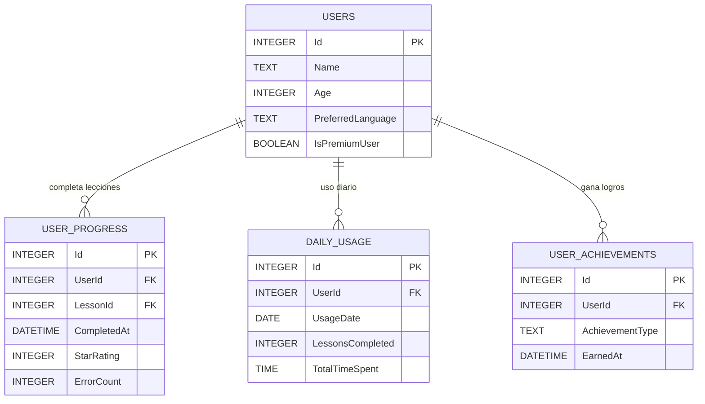

# Modelo Entidad-Relación (ERD) - EduPlayKids

## 1. Resumen Ejecutivo

Este documento define el modelo entidad-relación de la base de datos SQLite para EduPlayKids, diseñado para funcionamiento offline-first en dispositivos móviles individuales. El modelo soporta usuarios múltiples por dispositivo, progreso educativo detallado, contenido bilingüe, y cumplimiento del modelo freemium.

## 2. Diagrama Entidad-Relación Principal

### 2.1 ERD Completo


## 3. Entidades Principales

### 3.1 USERS (Usuarios del Dispositivo)

**Propósito**: Almacena información básica de todos los usuarios (niños) que utilizan la aplicación en el dispositivo.

**Características Principales**:
- Soporte para múltiples perfiles por dispositivo
- Información mínima requerida (solo nombre y edad)
- Gestión de estado premium
- Tracking de actividad

**Campos Clave**:
- `Id`: Clave primaria autoincremental
- `Name`: Nombre del niño (máx 50 caracteres)
- `Age`: Edad entre 3-8 años
- `PreferredLanguage`: "es" o "en"
- `IsPremiumUser`: Estado de suscripción premium
- `PremiumExpiryDate`: Fecha de expiración premium

### 3.2 EDUCATIONAL_MODULES (Módulos Educativos)

**Propósito**: Define los módulos principales del currículum (Matemáticas, Lectura, Ciencias, etc.).

**Características Principales**:
- Contenido bilingüe con claves de localización
- Ordenamiento curricular
- Restricciones de edad
- Alineación con estándares educativos

**Campos Clave**:
- `ModuleCode`: Identificador único (ej: "MATH_BASIC", "READ_PHONICS")
- `NameKey_EN/ES`: Claves para localización de nombres
- `MinAge/MaxAge`: Rango de edad apropiado
- `CurriculumStandard`: Estándar educativo (Common Core, etc.)

### 3.3 LESSON_CONTENT (Contenido de Lecciones)

**Propósito**: Almacena el contenido educativo detallado de cada lección.

**Características Principales**:
- Contenido interactivo en formato JSON
- Assets bilingües (audio/imágenes)
- Prerequisitos y objetivos de aprendizaje
- Metadatos para progresión adaptativa

**Campos Clave**:
- `LessonCode`: Código único (ej: "MATH001_L01")
- `InteractiveContentJson`: Contenido interactivo estructurado
- `AudioAssets_EN/ES`: Rutas de archivos de audio por idioma
- `DifficultyLevel`: Nivel 1-5 para algoritmo adaptativo

### 3.4 USER_PROGRESS (Progreso del Usuario)

**Propósito**: Rastrea el progreso detallado de cada usuario en cada lección.

**Características Principales**:
- Tracking detallado de performance
- Almacenamiento de respuestas para análisis
- Métricas de tiempo y errores
- Sistema de calificación con estrellas

**Campos Clave**:
- `AttemptCount`: Número de intentos
- `ErrorCount`: Errores cometidos
- `StarRating`: Calificación 1-3 estrellas
- `AnswersJson`: Respuestas detalladas para análisis
- `SessionData`: Datos de sesión para continuidad

## 4. Diagramas de Relaciones Específicas

### 4.1 Relaciones de Usuario y Progreso



### 4.2 Estructura de Contenido Educativo


### 4.3 Sistema de Analytics y Configuración


## 5. Patrones de Diseño Aplicados

### 5.1 Patrón de Localización

**Implementación**: Claves de localización en lugar de texto directo
- `NameKey_EN` / `NameKey_ES` para contenido bilingüe
- Tabla `CONTENT_LOCALIZATION` para textos centralizados
- Fallback automático a inglés cuando español no disponible

**Beneficios**:
- Consistencia en traducciones
- Facilidad para agregar nuevos idiomas
- Menor duplicación de datos

### 5.2 Patrón de Configuración Key-Value

**Implementación**: 
- `APP_SETTINGS` para configuración global
- `USER_PREFERENCES` para configuración por usuario
- Tipado flexible con campo `DataType`

**Beneficios**:
- Extensibilidad sin cambios de schema
- Configuración granular por usuario
- Facilidad para A/B testing futuro

### 5.3 Patrón de Event Sourcing (Simplificado)

**Implementación**: Tabla `ANALYTICS_EVENTS` para tracking
- Eventos inmutables con timestamp
- Procesamiento offline con sincronización posterior
- Parametrización flexible con JSON

**Beneficios**:
- Auditabilidad completa de acciones
- Análisis posterior de patrones de uso
- Compliance con privacy regulations

## 6. Consideraciones de Performance

### 6.1 Estrategia de Indexado

**Índices Principales**:
```sql
-- Performance crítico para login y progreso
CREATE INDEX idx_users_name ON USERS(Name);
CREATE INDEX idx_user_progress_user_lesson ON USER_PROGRESS(UserId, LessonId);
CREATE INDEX idx_user_progress_completed ON USER_PROGRESS(UserId, CompletedAt);

-- Queries frecuentes de contenido
CREATE INDEX idx_lesson_content_module ON LESSON_CONTENT(ModuleId, SortOrder);
CREATE INDEX idx_lesson_content_active ON LESSON_CONTENT(IsActive, DifficultyLevel);

-- Analytics y reportes
CREATE INDEX idx_daily_usage_user_date ON DAILY_USAGE(UserId, UsageDate);
CREATE INDEX idx_analytics_events_sync ON ANALYTICS_EVENTS(IsSynced, EventTimestamp);
```

### 6.2 Optimizaciones de Almacenamiento

**Técnicas Aplicadas**:
- **Normalización Balanceada**: Evitar over-normalization para queries móviles
- **JSON Selectivo**: Solo para datos semi-estructurados (respuestas, configuración)
- **Datos Calculados**: `StarRating` calculado pero almacenado para performance
- **Compresión de Assets**: Rutas relativas, no URLs completas

### 6.3 Gestión de Espacio

**Estrategias**:
- **Data Retention**: Limpieza automática de eventos analytics > 30 días
- **Compression**: JSON minificado en producción
- **Partitioning**: `DAILY_USAGE` por fecha para queries eficientes
- **Vacuum**: Rutina de mantenimiento programada

## 7. Consideraciones de Seguridad y Privacy

### 7.1 Datos Sensibles

**Protecciones Implementadas**:
- **No PII**: Nombres de niños son solo "first name", no apellidos
- **Local Only**: Toda la data permanece en dispositivo
- **Anonymization**: Analytics events sin identificadores persistentes
- **Encryption**: SQLCipher para datos en reposo (futuro)

### 7.2 COPPA Compliance

**Medidas Específicas**:
- **Minimal Data**: Solo datos estrictamente necesarios
- **Parental Control**: Preferences requieren PIN parental
- **No Tracking**: Session IDs rotan en cada app launch
- **Data Portability**: Export JSON para transferencia de datos

## 8. Escalabilidad y Evolución

### 8.1 Preparación para Funcionalidades Futuras

**Extensiones Planeadas**:
- **Multi-Device Sync**: Campo `DeviceId` preparado
- **Offline-Online Hybrid**: Campos `IsSynced` y timestamps
- **Advanced Analytics**: Schema extensible con JSON
- **Content Updates**: Versionado de contenido con `UpdatedAt`

### 8.2 Migration Strategy

**Versioning Schema**:
```sql
CREATE TABLE schema_migrations (
    version TEXT PRIMARY KEY,
    applied_at DATETIME DEFAULT CURRENT_TIMESTAMP
);
```

**Backward Compatibility**:
- Nuevas columnas como nullable
- Deprecation gradual de campos obsoletos
- Data migration scripts documentados

## 9. Métricas y Monitoreo

### 9.1 Health Metrics

**Métricas Clave a Trackear**:
- Database size growth rate
- Query performance percentiles
- Crash rates relacionados a DB
- User engagement patterns

### 9.2 Performance Benchmarks

**Targets Objetivo**:
- User login: < 100ms
- Lesson load: < 200ms
- Progress save: < 50ms
- Analytics flush: < 1s
- Database size: < 100MB (95% users)

---

**Documento ERD - EduPlayKids v1.0**
**Fecha**: 16 de Septiembre, 2024
**Estado**: Design Phase - Ready for Implementation
**Próxima Revisión**: Post Schema Implementation