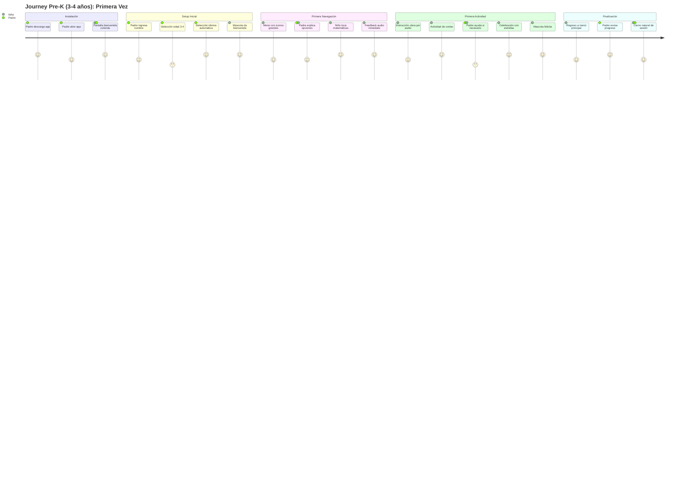
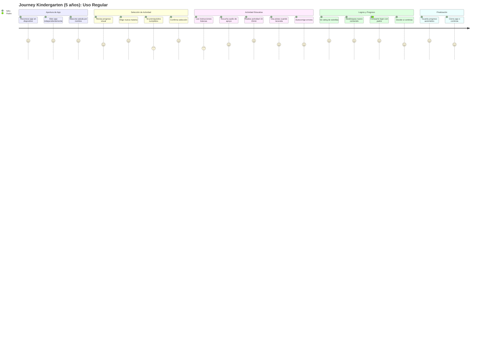
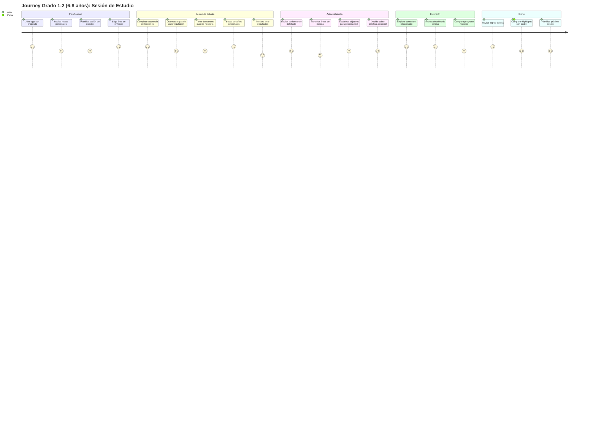

# User Journey Maps - EduPlayKids

## 📋 Información del Documento

| Campo | Detalle |
|-------|---------|
| **Proyecto** | EduPlayKids |
| **Versión** | 1.0 |
| **Fecha** | Septiembre 2024 |
| **Tipo** | User Journey Maps |
| **Audiencia** | Niños 3-8 años |

---

## 🎯 Resumen Ejecutivo

Los mapas de experiencia de usuario de EduPlayKids están diseñados para tres grupos de edad específicos, considerando las diferencias cognitivas, de atención y de destreza motriz de cada etapa del desarrollo infantil. Cada journey prioriza la autonomía progresiva mientras mantiene puntos de control parental.

## 📊 Metodología de Journey Mapping

### Principios de Diseño por Edad

**Consideraciones Cognitivas:**
- **3-4 años**: Pensamiento concreto, necesita apoyo visual constante
- **5 años**: Transición a pensamiento abstracto, mayor independencia
- **6-8 años**: Pensamiento lógico en desarrollo, comprende secuencias

**Consideraciones de Atención:**
- **3-4 años**: 5-10 minutos de atención sostenida
- **5 años**: 10-15 minutos de atención sostenida  
- **6-8 años**: 15-25 minutos de atención sostenida

**Consideraciones Motrices:**
- **3-4 años**: Coordinación gruesa, taps grandes, gestos simples
- **5 años**: Motricidad fina en desarrollo, drags cortos
- **6-8 años**: Precisión motriz, gestos complejos

---

## 🚼 Journey Map: Pre-K (3-4 años)

### Perfil del Usuario
- **Edad**: 3-4 años
- **Nivel Cognitivo**: Pensamiento preoperacional
- **Tiempo de Atención**: 5-10 minutos
- **Autonomía**: Requiere supervisión parental constante
- **Motivación**: Reconocimiento inmediato, estímulos visuales/auditivos

### Journey Principal: "Primera Experiencia Educativa"

### Touchpoints y Emociones

| **Fase** | **Touchpoint** | **Emoción del Niño** | **Emoción del Padre** | **Oportunidad** |
|----------|----------------|----------------------|----------------------|-----------------|
| **Instalación** | Pantalla de bienvenida | 😊 Curiosidad | 😐 Evaluativo | Impresión positiva inmediata |
| **Setup** | Selección de edad | 😐 Neutral | 😊 Confianza | Personalización clara |
| **Navegación** | Iconos grandes | 😄 Emocionado | 😊 Satisfecho | Autonomía guiada |
| **Actividad** | Contar objetos | 😆 Diversión | 😊 Orgulloso | Aprendizaje natural |
| **Completación** | Estrellas + mascota | 😍 Euforia | 😍 Muy satisfecho | Motivación para continuar |

### Pain Points Específicos

🔴 **Pain Points Críticos:**
1. **Botones muy pequeños** - Frustración por toques fallidos
2. **Instrucciones complejas** - Confusión y abandono
3. **Tiempo de respuesta lento** - Pérdida de atención
4. **Falta de feedback inmediato** - Incertidumbre

🟡 **Pain Points Menores:**
1. **Muchas opciones en pantalla** - Sobrecarga cognitiva
2. **Transiciones muy rápidas** - Desorientación
3. **Audio muy rápido** - No comprende instrucciones

### Moments of Joy

✨ **Joy Moments:**
1. **Mascota les da la bienvenida** - Conexión emocional
2. **Primer toque exitoso** - Sensación de competencia
3. **Celebración con estrellas** - Reconocimiento visual
4. **Audio de felicitación** - Validación social
5. **Padre expresa orgullo** - Vinculación emocional

### Interacciones Padre-Hijo

**👨‍👩‍👧‍👦 Momentos de Interacción:**
- **Setup inicial** (100% padre): Configuración de perfil
- **Primera navegación** (70% padre, 30% niño): Exploración guiada
- **Durante actividad** (20% padre, 80% niño): Supervisión mínima
- **Celebración de logros** (50% cada uno): Momentos compartidos

---

## 🎒 Journey Map: Kindergarten (5 años)

### Perfil del Usuario
- **Edad**: 5 años
- **Nivel Cognitivo**: Transición preoperacional-concreto
- **Tiempo de Atención**: 10-15 minutos
- **Autonomía**: Semi-independiente con supervisión ocasional
- **Motivación**: Progreso visible, coleccionar logros

### Journey Principal: "Explorador Independiente"

### Touchpoints y Emociones

| **Fase** | **Touchpoint** | **Emoción del Niño** | **Emoción del Padre** | **Oportunidad** |
|----------|----------------|----------------------|----------------------|-----------------|
| **Apertura** | Reconocimiento automático | 😊 Familiaridad | 😊 Tranquilidad | Habituación positiva |
| **Selección** | Progreso visual | 😄 Motivación | 😊 Satisfecho | Engagement continuo |
| **Actividad** | Desafío apropiado | 😤 Concentración | 😐 Neutro | Flow estado |
| **Logros** | Desbloqueo contenido | 😆 Emoción | 😍 Orgullo | Retención alta |
| **Finalización** | Guardado automático | 😌 Satisfacción | 😊 Confianza | Regreso asegurado |

### Pain Points Específicos

🔴 **Pain Points Críticos:**
1. **Actividades muy fáciles** - Aburrimiento
2. **Salto de dificultad abrupto** - Frustración
3. **Límite freemium inesperado** - Confusión y decepción
4. **Pistas no claras** - Sensación de estar perdido

🟡 **Pain Points Menores:**
1. **Prerequisitos no obvios** - Confusión en progresión
2. **Tiempo de carga visible** - Impaciencia
3. **Interrupciones parentales** - Pérdida de flow

### Moments of Joy

✨ **Joy Moments:**
1. **Desbloqueo de contenido nuevo** - Sensación de progreso
2. **Perfecta calificación (3 estrellas)** - Sensación de maestría
3. **Reconocimiento de la mascota** - Conexión emocional
4. **Superar un desafío difícil** - Autoeficacia
5. **Mostrar logros a padres** - Validación social

### Interacciones Padre-Hijo

**👨‍👩‍👧‍👦 Momentos de Interacción:**
- **Setup inicial** (80% padre, 20% niño): Niño participa en decisiones
- **Selección de actividades** (20% padre, 80% niño): Autonomía con supervisión
- **Durante actividad** (10% padre, 90% niño): Uso mayormente independiente
- **Revisión de progreso** (60% padre, 40% niño): Análisis conjunto semanal

---

## 🎓 Journey Map: Grado 1-2 (6-8 años)

### Perfil del Usuario
- **Edad**: 6-8 años
- **Nivel Cognitivo**: Operaciones concretas
- **Tiempo de Atención**: 15-25 minutos
- **Autonomía**: Altamente independiente
- **Motivación**: Desafíos, competencia personal, logros a largo plazo

### Journey Principal: "Estudiante Autónomo"

### Touchpoints y Emociones

| **Fase** | **Touchpoint** | **Emoción del Niño** | **Emoción del Padre** | **Oportunidad** |
|----------|----------------|----------------------|----------------------|-----------------|
| **Planificación** | Dashboard personal | 😤 Determinación | 😊 Orgullo | Desarrollo de autonomía |
| **Estudio** | Desafíos progresivos | 🤔 Concentración | 😐 Observación | Deep learning |
| **Autoevaluación** | Métricas detalladas | 😌 Reflexión | 😍 Admiración | Metacognición |
| **Extensión** | Contenido avanzado | 😆 Emoción | 😊 Satisfacción | Crecimiento acelerado |
| **Cierre** | Progreso a largo plazo | 😊 Satisfacción | 😍 Muy orgulloso | Motivación intrínseca |

### Pain Points Específicos

🔴 **Pain Points Críticos:**
1. **Contenido repetitivo** - Aburrimiento y abandono
2. **Falta de desafíos avanzados** - Frustración por límites
3. **Métricas no significativas** - Pérdida de motivación
4. **Interrupciones por límite freemium** - Frustración en flow
5. **Falta de control sobre progresión** - Sensación de restricción

🟡 **Pain Points Menores:**
1. **Feedback muy básico** - Expectativa de análisis profundo
2. **Opciones de personalización limitadas** - Deseo de individualización
3. **Falta de objetivos a largo plazo** - Pérdida de propósito

### Moments of Joy

✨ **Joy Moments:**
1. **Completar un desafío de corona** - Sensación de maestría
2. **Ver progreso a lo largo del tiempo** - Satisfacción del crecimiento
3. **Superar su propio récord** - Competencia personal
4. **Desbloquear contenido avanzado** - Sensación de progreso
5. **Explicar conceptos a hermanos menores** - Rol de mentor
6. **Reconocimiento parental por autodisciplina** - Validación de autonomía

### Interacciones Padre-Hijo

**👨‍👩‍👧‍👦 Momentos de Interacción:**
- **Setup inicial** (60% padre, 40% niño): Niño lidera preferencias
- **Planificación de estudio** (20% padre, 80% niño): Supervisión ligera
- **Durante actividad** (5% padre, 95% niño): Uso completamente independiente
- **Revisión de progreso** (40% padre, 60% niño): Niño presenta y analiza datos
- **Establecimiento de metas** (30% padre, 70% niño): Colaboración en objetivos

---

## 🔄 Análisis Comparativo de Journeys

### Evolución de la Autonomía

| **Aspecto** | **Pre-K (3-4)** | **Kindergarten (5)** | **Grado 1-2 (6-8)** |
|-------------|------------------|----------------------|---------------------|
| **Supervisión Parental** | Constante (80%) | Ocasional (30%) | Mínima (10%) |
| **Duración de Sesión** | 5-10 minutos | 10-15 minutos | 15-25 minutos |
| **Tipo de Motivación** | Extrínseca inmediata | Mixta | Intrínseca progresiva |
| **Complejidad de Feedback** | Visual simple | Visual + numérico | Analítico detallado |
| **Control de Progresión** | Padre controla | Niño elige con guía | Niño autodirige |

### Pain Points Universales

🚨 **Críticos para Todas las Edades:**
1. **Tiempo de respuesta lento** - Pérdida de atención
2. **Falta de feedback inmediato** - Incertidumbre
3. **Dificultad inadecuada** - Frustración o aburrimiento
4. **Interrupciones técnicas** - Pérdida de flow

⚠️ **Importantes por Edad:**
- **3-4 años**: Complejidad visual, botones pequeños
- **5 años**: Balance autonomía/supervisión, transiciones
- **6-8 años**: Falta de personalización, métricas superficiales

### Oportunidades de Mejora

✨ **Todas las Edades:**
1. **Personalización progresiva** - Adaptación al desarrollo
2. **Feedback contextual** - Apropiado para nivel cognitivo
3. **Engagement emocional** - Mascota como compañero de aprendizaje
4. **Celebración de logros** - Reconocimiento apropiado por edad

🎯 **Específicas por Edad:**
- **3-4 años**: Simplificación visual, apoyo parental integrado
- **5 años**: Balance de desafío, progresión clara
- **6-8 años**: Herramientas de autoanálisis, objetivos personales

---

## 📱 Consideraciones de Implementación

### Adaptaciones por Dispositivo

**Pantallas Pequeñas (< 5.5"):**
- Botones aún más grandes para 3-4 años
- Navegación simplificada
- Contenido esencial solamente

**Tablets:**
- Aprovechamiento de espacio para contenido contextual
- Modo padre/hijo lado a lado
- Visualizaciones más ricas

### Estados de la Aplicación

**Estado Offline:**
- Indicadores claros de contenido disponible
- Sincronización transparente cuando regresa conectividad
- Experiencia sin interrupciones

**Estado de Límite Freemium:**
- Comunicación clara y amigable
- Opciones de valor inmediato
- Mantenimiento de progreso

### Accesibilidad

**Motriz:**
- Botones mínimo 60dp (idealmente 80dp para 3-4 años)
- Tiempo de respuesta < 100ms
- Gestos simples y naturales

**Cognitiva:**
- Instrucciones claras y repetibles
- Progresión lógica y predecible
- Apoyo visual constante

**Auditiva:**
- Subtítulos opcionales
- Controles de volumen evidentes
- Feedback visual alternativo

---

## 🎯 Próximos Pasos

### Validación de Journeys
1. **Testing con usuarios reales** por grupo de edad
2. **Observación de interacciones padre-hijo**
3. **Medición de pain points** en prototipo
4. **Optimización de moments of joy**

### Iteración Continua
1. **Analytics de comportamiento** por edad
2. **A/B testing** de flujos críticos
3. **Feedback cualitativo** de familias beta
4. **Adaptación basada en datos** de uso real

---

**Documento User Journey Maps - EduPlayKids v1.0**  
**Fecha**: Septiembre 2024  
**Estado**: Diseño UX - Listo para Validación con Usuarios**  
**Próxima Revisión**: Post-Testing de Usabilidad**