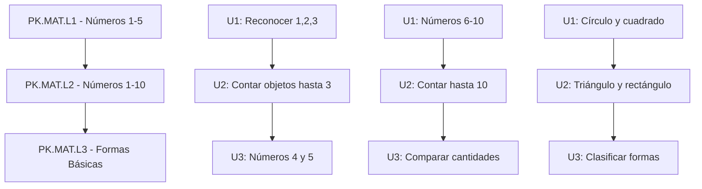
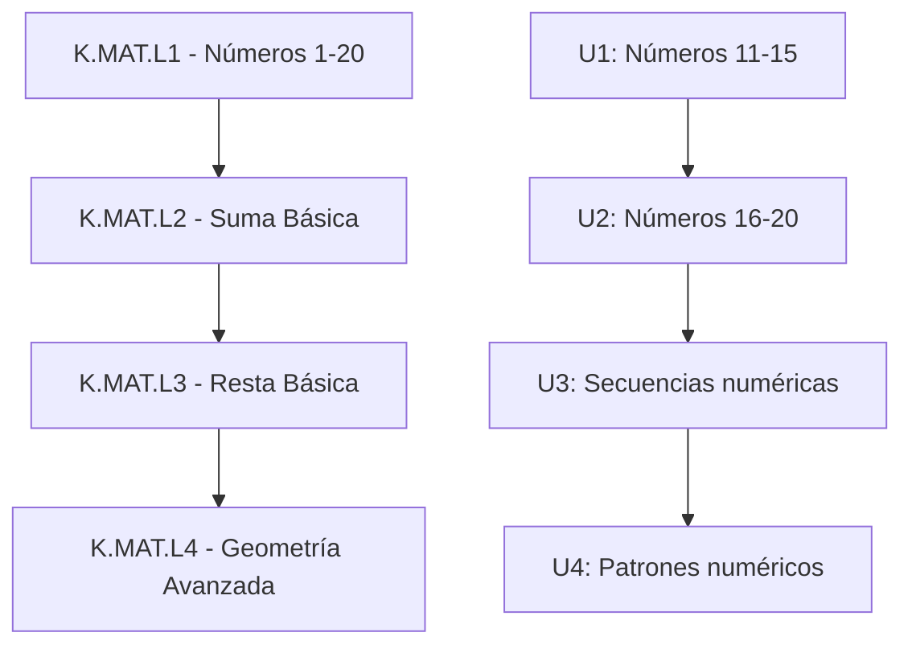
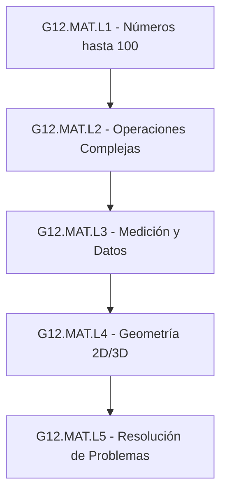
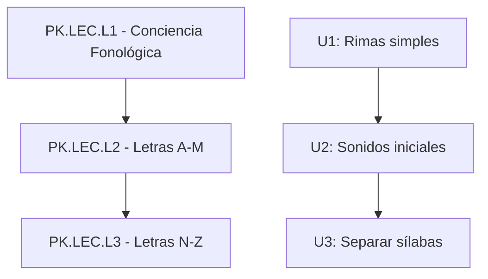
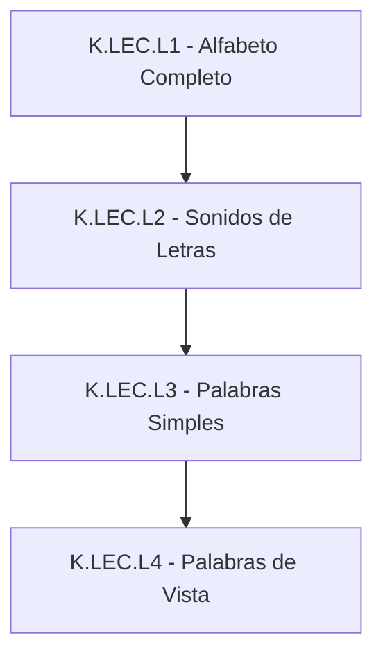
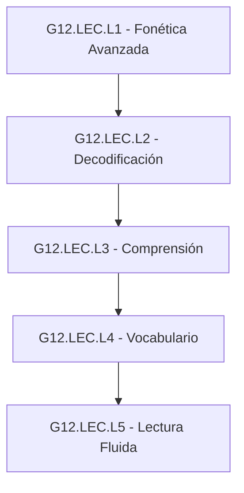

# Matriz de Progresión Curricular - EduPlayKids

## Información del Documento
- **Proyecto**: EduPlayKids - Aplicación Educativa Móvil
- **Versión**: 1.0
- **Fecha**: Septiembre 2025
- **Autor**: Equipo de Contenido Educativo
- **Alineación**: Common Core, NGSS, SEL Framework

---

## Resumen Ejecutivo

La Matriz de Progresión Curricular define la secuencia de aprendizaje estructurada para niños de 3-8 años, organizando 450+ actividades educativas en una progresión lógica que respeta el desarrollo cognitivo natural. Cada competencia está mapeada con prerequisitos claros, objetivos específicos y criterios de dominio, asegurando una experiencia de aprendizaje coherente y efectiva.

---

## Estructura de Niveles de Progresión

### Sistema de Codificación de Niveles
```
[Grupo de Edad].[Área].[Nivel].[Unidad]
Ejemplo: PK.MAT.L1.U3 = Pre-K → Matemáticas → Nivel 1 → Unidad 3
```

### Grupos de Edad y Características

#### Pre-K (3-4 años) - Exploración y Descubrimiento
- **Duración de atención**: 3-5 minutos
- **Modalidad principal**: Exploración sensorial y juego libre
- **Progresión**: 3 niveles por área (L1, L2, L3)
- **Total actividades**: ~120

#### Kindergarten (5 años) - Reconocimiento y Patrones
- **Duración de atención**: 5-8 minutos
- **Modalidad principal**: Reconocimiento y seguimiento de instrucciones
- **Progresión**: 4 niveles por área (L1, L2, L3, L4)
- **Total actividades**: ~160

#### Grados 1-2 (6-8 años) - Aplicación y Síntesis
- **Duración de atención**: 8-12 minutos
- **Modalidad principal**: Aplicación y resolución de problemas
- **Progresión**: 5 niveles por área (L1, L2, L3, L4, L5)
- **Total actividades**: ~170

---

## Matriz de Progresión por Área

### 🔢 MATEMÁTICAS (MAT)

#### Pre-K (3-4 años) - Matemáticas


##### Detalle de Progresión Pre-K Matemáticas

**PK.MAT.L1 - Números 1-5 (Duración: 2-3 semanas)**
| Unidad | Competencias | Actividades | Criterio de Dominio |
|--------|--------------|-------------|-------------------|
| U1 | Reconocer números 1, 2, 3 | 8 actividades | 7/8 correctas en 2 intentos consecutivos |
| U2 | Contar objetos hasta 3 | 6 actividades | Contar correctamente en 4/5 ejercicios |
| U3 | Números 4 y 5 | 8 actividades | Identificar y contar en 7/8 actividades |

**PK.MAT.L2 - Números 1-10 (Duración: 3-4 semanas)**
| Unidad | Competencias | Actividades | Criterio de Dominio |
|--------|--------------|-------------|-------------------|
| U1 | Reconocer números 6-10 | 10 actividades | 8/10 correctas en primer intento |
| U2 | Contar hasta 10 | 8 actividades | Secuencia correcta en 6/8 ejercicios |
| U3 | Comparar más/menos | 6 actividades | Comparaciones correctas en 5/6 casos |

**PK.MAT.L3 - Formas Básicas (Duración: 2-3 semanas)**
| Unidad | Competencias | Actividades | Criterio de Dominio |
|--------|--------------|-------------|-------------------|
| U1 | Círculo y cuadrado | 6 actividades | Identificación en 5/6 contextos |
| U2 | Triángulo y rectángulo | 6 actividades | Diferenciación en 5/6 casos |
| U3 | Clasificar por forma | 8 actividades | Clasificación correcta en 7/8 grupos |

#### Kindergarten (5 años) - Matemáticas


##### Detalle de Progresión Kindergarten Matemáticas

**K.MAT.L1 - Números 1-20 (Duración: 4-5 semanas)**
| Unidad | Competencias | Actividades | Prerequisitos | Criterio de Dominio |
|--------|--------------|-------------|---------------|-------------------|
| U1 | Números 11-15 | 10 actividades | PK.MAT.L2 completo | 8/10 en primer intento |
| U2 | Números 16-20 | 10 actividades | K.MAT.L1.U1 | 8/10 en primer intento |
| U3 | Secuencias 1-20 | 8 actividades | K.MAT.L1.U2 | Completar 6/8 secuencias |
| U4 | Patrones numéricos | 6 actividades | K.MAT.L1.U3 | Identificar patrones en 5/6 casos |

**K.MAT.L2 - Suma Básica (Duración: 3-4 semanas)**
| Unidad | Competencias | Actividades | Prerequisitos | Criterio de Dominio |
|--------|--------------|-------------|---------------|-------------------|
| U1 | Suma hasta 5 | 12 actividades | K.MAT.L1 completo | 10/12 correctas |
| U2 | Suma hasta 10 | 10 actividades | K.MAT.L2.U1 | 8/10 correctas |
| U3 | Problemas de suma | 8 actividades | K.MAT.L2.U2 | Resolver 6/8 problemas |

#### Grados 1-2 (6-8 años) - Matemáticas


---

### 📚 LECTURA Y FONÉTICA (LEC)

#### Pre-K (3-4 años) - Lectura


##### Detalle de Progresión Pre-K Lectura

**PK.LEC.L1 - Conciencia Fonológica (Duración: 3-4 semanas)**
| Unidad | Competencias | Actividades | Criterio de Dominio |
|--------|--------------|-------------|-------------------|
| U1 | Identificar rimas | 8 actividades | Reconocer rimas en 6/8 pares |
| U2 | Sonidos iniciales | 10 actividades | Identificar sonido inicial en 8/10 palabras |
| U3 | Separar sílabas | 6 actividades | Separar correctamente 5/6 palabras |

**PK.LEC.L2 - Letras A-M (Duración: 4-5 semanas)**
| Unidad | Competencias | Actividades | Criterio de Dominio |
|--------|--------------|-------------|-------------------|
| U1 | Letras A-F | 12 actividades | Reconocer 5/6 letras consistentemente |
| U2 | Letras G-M | 14 actividades | Reconocer 6/7 letras consistentemente |
| U3 | Trazado A-M | 10 actividades | Trazar correctamente 10/13 letras |

#### Kindergarten (5 años) - Lectura


##### Detalle de Progresión Kindergarten Lectura

**K.LEC.L1 - Alfabeto Completo (Duración: 5-6 semanas)**
| Unidad | Competencias | Actividades | Prerequisitos | Criterio de Dominio |
|--------|--------------|-------------|---------------|-------------------|
| U1 | Mayúsculas A-Z | 15 actividades | PK.LEC.L2-L3 | 24/26 letras en 2 intentos |
| U2 | Minúsculas a-z | 15 actividades | K.LEC.L1.U1 | 24/26 letras en 2 intentos |
| U3 | Orden alfabético | 8 actividades | K.LEC.L1.U2 | Ordenar correctamente 6/8 grupos |

**K.LEC.L2 - Sonidos de Letras (Duración: 4-5 semanas)**
| Unidad | Competencias | Actividades | Prerequisitos | Criterio de Dominio |
|--------|--------------|-------------|---------------|-------------------|
| U1 | Consonantes | 15 actividades | K.LEC.L1 completo | 18/21 sonidos correctos |
| U2 | Vocales | 10 actividades | K.LEC.L2.U1 | 5/5 vocales correctas |
| U3 | Combinaciones | 12 actividades | K.LEC.L2.U2 | 10/12 combinaciones |

#### Grados 1-2 (6-8 años) - Lectura


---

### 🌱 CIENCIAS (CIE)

#### Progresión Temática por Edad

```mermaid
graph TD
    subgraph "Pre-K (3-4 años)"
        PK_CIE_L1[Animales Domésticos] --> PK_CIE_L2[Plantas Básicas]
        PK_CIE_L2 --> PK_CIE_L3[Mi Cuerpo]
    end
    
    subgraph "Kindergarten (5 años)"
        K_CIE_L1[Hábitats] --> K_CIE_L2[Estaciones]
        K_CIE_L2 --> K_CIE_L3[Cinco Sentidos]
        K_CIE_L3 --> K_CIE_L4[Día y Noche]
    end
    
    subgraph "Grados 1-2 (6-8 años)"
        G12_CIE_L1[Ciclos de Vida] --> G12_CIE_L2[Estados de Materia]
        G12_CIE_L2 --> G12_CIE_L3[Tiempo y Clima]
        G12_CIE_L3 --> G12_CIE_L4[Ecosistemas]
        G12_CIE_L4 --> G12_CIE_L5[Experimentos Simples]
    end
```



##### Detalle de Progresión Ciencias

**Pre-K Ciencias - Enfoque Exploratorio**
| Nivel | Tema | Duración | Actividades | Objetivo Principal |
|-------|------|----------|-------------|-------------------|
| L1 | Animales Domésticos | 2 semanas | 8 actividades | Reconocer y nombrar |
| L2 | Plantas Básicas | 2 semanas | 6 actividades | Partes de las plantas |
| L3 | Mi Cuerpo | 3 semanas | 10 actividades | Partes del cuerpo y cuidado |

**Kindergarten Ciencias - Enfoque Clasificatorio**
| Nivel | Tema | Duración | Actividades | Objetivo Principal |
|-------|------|----------|-------------|-------------------|
| L1 | Hábitats | 3 semanas | 12 actividades | Clasificar animales por hábitat |
| L2 | Estaciones | 2 semanas | 8 actividades | Características de cada estación |
| L3 | Cinco Sentidos | 3 semanas | 15 actividades | Asociar sentido con órgano |
| L4 | Día y Noche | 2 semanas | 8 actividades | Actividades diurnas/nocturnas |

---

### 🎨 ARTE Y CREATIVIDAD (ART)

#### Progresión de Habilidades Artísticas

```mermaid
graph TD
    subgraph "Desarrollo Motor Fino"
        A[Trazos Libres] --> B[Líneas Controladas]
        B --> C[Formas Básicas]
        C --> D[Dibujos Representativos]
    end
    
    subgraph "Teoría del Color"
        E[Colores Primarios] --> F[Colores Secundarios]
        F --> G[Mezclas]
        G --> H[Armonías]
    end
    
    subgraph "Expresión Creativa"
        I[Exploración Libre] --> J[Proyectos Dirigidos]
        J --> K[Composición]
        K --> L[Estilo Personal]
    end
```



##### Detalle de Progresión Arte

**Pre-K Arte - Exploración Sensorial**
| Nivel | Enfoque | Duración | Actividades | Desarrollo Principal |
|-------|---------|----------|-------------|---------------------|
| L1 | Colores primarios | 2 semanas | 6 actividades | Reconocimiento visual |
| L2 | Trazos libres | 2 semanas | 8 actividades | Motricidad fina |
| L3 | Formas básicas | 2 semanas | 6 actividades | Control de movimiento |

**Kindergarten Arte - Técnicas Básicas**
| Nivel | Enfoque | Duración | Actividades | Desarrollo Principal |
|-------|---------|----------|-------------|---------------------|
| L1 | Líneas y puntos | 2 semanas | 8 actividades | Precisión motora |
| L2 | Colores secundarios | 2 semanas | 6 actividades | Teoría básica del color |
| L3 | Patrones simples | 3 semanas | 10 actividades | Secuenciación visual |
| L4 | Texturas visuales | 2 semanas | 6 actividades | Percepción táctil |

---

### 🧩 LÓGICA Y PENSAMIENTO CRÍTICO (LOG)

#### Desarrollo de Habilidades Cognitivas

```mermaid
graph TD
    subgraph "Pre-K (3-4 años)"
        PK_LOG_L1[Clasificación Simple] --> PK_LOG_L2[Patrones AB]
        PK_LOG_L2 --> PK_LOG_L3[Secuencias de 3]
    end
    
    subgraph "Kindergarten (5 años)"
        K_LOG_L1[Clasificación Múltiple] --> K_LOG_L2[Patrones ABC]
        K_LOG_L2 --> K_LOG_L3[Secuencias de 5]
        K_LOG_L3 --> K_LOG_L4[Causa y Efecto]
    end
    
    subgraph "Grados 1-2 (6-8 años)"
        G12_LOG_L1[Clasificación Jerárquica] --> G12_LOG_L2[Patrones Complejos]
        G12_LOG_L2 --> G12_LOG_L3[Secuencias Largas]
        G12_LOG_L3 --> G12_LOG_L4[Resolución de Problemas]
        G12_LOG_L4 --> G12_LOG_L5[Pensamiento Estratégico]
    end
```



##### Detalle de Progresión Lógica

**Escalada de Complejidad en Resolución de Problemas**
| Edad | Tipo de Problema | Pasos Máximos | Tiempo Límite | Apoyo Visual |
|------|------------------|---------------|---------------|--------------|
| 3-4 años | Clasificación binaria | 1-2 pasos | Sin límite | 100% visual |
| 5 años | Secuencias simples | 2-3 pasos | 5 minutos | 80% visual |
| 6-8 años | Problemas multi-paso | 3-5 pasos | 8 minutos | 60% visual |

---

### 💝 HABILIDADES SOCIOEMOCIONALES (SEL)

#### Progresión del Desarrollo Emocional

```mermaid
graph TD
    subgraph "Autoconciencia"
        A1[Reconocer emociones básicas] --> A2[Identificar causas]
        A2 --> A3[Expresar emociones]
        A3 --> A4[Regular emociones]
    end
    
    subgraph "Conciencia Social"
        B1[Reconocer emociones en otros] --> B2[Mostrar empatía]
        B2 --> B3[Ayudar a otros]
        B3 --> B4[Cooperar efectivamente]
    end
    
    subgraph "Autorregulación"
        C1[Esperar turnos] --> C2[Controlar impulsos]
        C2 --> C3[Persistir en tareas]
        C3 --> C4[Manejar frustración]
    end
```



##### Detalle de Progresión Socioemocional

**Pre-K Socioemocional - Identificación**
| Nivel | Enfoque | Competencias | Actividades | Indicadores de Progreso |
|-------|---------|-------------|-------------|------------------------|
| L1 | Emociones básicas | Feliz, triste, enojado | 6 actividades | Identifica en 4/5 caras |
| L2 | Expresión personal | "Yo me siento..." | 5 actividades | Expresa emoción propia 3/4 veces |
| L3 | Empatía básica | Reconocer en otros | 4 actividades | Identifica emoción ajena 3/4 veces |

**Kindergarten Socioemocional - Comprensión**
| Nivel | Enfoque | Competencias | Actividades | Indicadores de Progreso |
|-------|---------|-------------|-------------|------------------------|
| L1 | Causas de emociones | ¿Por qué se siente así? | 8 actividades | Explica causa 6/8 veces |
| L2 | Autorregulación | Técnicas de calma | 6 actividades | Usa técnica apropiada 4/6 veces |
| L3 | Resolución conflictos | Hablar y escuchar | 5 actividades | Resuelve pacíficamente 3/5 veces |
| L4 | Cooperación | Trabajar juntos | 7 actividades | Colabora efectivamente 5/7 veces |

---

## Evaluación y Criterios de Progresión

### Sistema de Evaluación por Competencias

#### Niveles de Dominio
1. **Iniciante (0-59%)**: Necesita apoyo significativo
2. **En Desarrollo (60-79%)**: Dominio parcial con apoyo ocasional
3. **Competente (80-89%)**: Dominio independiente y consistente
4. **Avanzado (90-100%)**: Dominio excepcional y transferible

#### Criterios de Avance de Nivel
- **Mínimo**: 80% de competencia en todas las unidades del nivel actual
- **Tiempo mínimo**: Completar duración mínima recomendada
- **Consistencia**: Demostrar dominio en al menos 2 sesiones separadas
- **Transferencia**: Aplicar aprendizaje en contexto nuevo (opcional para Pre-K)

### Métricas de Progresión

#### Velocidad de Aprendizaje
```
Velocidad = (Competencias dominadas / Tiempo invertido) × 100
Benchmark:
- Pre-K: 2-3 competencias por semana
- Kindergarten: 3-4 competencias por semana  
- Grados 1-2: 4-5 competencias por semana
```

#### Retención de Conocimiento
```
Retención = (Competencias mantenidas / Competencias aprendidas) × 100
Meta: >85% después de 2 semanas sin práctica
```

#### Transferencia de Aprendizaje
```
Transferencia = (Aplicaciones exitosas en contexto nuevo / Oportunidades de aplicación) × 100
Meta: >70% para nivel Competente
```

---

## Personalización y Adaptación

### Rutas de Aprendizaje Personalizadas

#### Perfil de Aprendiz Acelerado
- **Criterio**: Domina >90% en tiempo <80% del promedio
- **Adaptación**: Acceso anticipado a nivel siguiente
- **Actividades adicionales**: Desafíos Crown Challenge
- **Enfoque**: Amplitud (más áreas) vs. profundidad

#### Perfil de Aprendiz Estándar
- **Criterio**: Progreso dentro de rangos esperados
- **Adaptación**: Secuencia curricular estándar
- **Apoyo**: Pistas y retroalimentación regular
- **Enfoque**: Progresión equilibrada

#### Perfil de Aprendiz que Necesita Apoyo
- **Criterio**: Requiere >120% del tiempo promedio para dominio
- **Adaptación**: Actividades de refuerzo adicionales
- **Apoyo**: Más práctica, pistas visuales, pasos más pequeños
- **Enfoque**: Consolidación antes de avanzar

### Algoritmo de Adaptación
```python
def adapt_progression(student_performance):
    if success_rate > 0.9 and time_ratio < 0.8:
        return "accelerated_path"
    elif success_rate < 0.6 or time_ratio > 1.2:
        return "reinforcement_path"
    else:
        return "standard_path"
```

---

## Gestión de Prerequisitos

### Mapa de Dependencias

#### Prerequisitos Estrictos (Obligatorios)
- No se puede acceder al nivel N+1 sin completar nivel N
- Ejemplo: K.MAT.L2 (Suma) requiere K.MAT.L1 (Números 1-20)

#### Prerequisitos Recomendados (Sugeridos)
- Se sugiere completar antes de avanzar, pero se permite flexibilidad
- Ejemplo: LEC.L3 (Palabras) se beneficia de MAT.L1 (Números) pero no es obligatorio

#### Prerequisitos Transversales (Entre Áreas)
- Habilidades de una área que benefician otra área
- Ejemplo: SEL.L1 (Atención) beneficia todas las demás áreas

### Matriz de Prerequisites por Nivel

| Nivel Objetivo | Prerequisites Estrictos | Prerequisites Recomendados | Prerequisites Transversales |
|---------------|------------------------|---------------------------|---------------------------|
| K.MAT.L1 | PK.MAT.L1, PK.MAT.L2 | PK.LEC.L1 | SEL.L1 (Atención) |
| K.LEC.L2 | K.LEC.L1 | PK.MAT.L1 (Números) | SEL.L2 (Seguir instrucciones) |
| G12.CIE.L3 | K.CIE.L1, K.CIE.L2 | K.LEC.L3 (Palabras) | LOG.L2 (Secuencias) |

---

## Monitoreo y Ajustes

### Dashboard de Progresión Curricular

#### Métricas Clave por Niño
1. **Velocidad de progresión** por área de conocimiento
2. **Patrones de dificultad** (áreas que requieren más tiempo)
3. **Fortalezas identificadas** (áreas de dominio excepcional)
4. **Brechas de aprendizaje** (prerequisitos no dominados)
5. **Proyección de completado** (tiempo estimado para dominar área)

#### Métricas Agregadas (Analíticas del Producto)
1. **Distribución de tiempo** por nivel y área
2. **Puntos de abandono** más comunes
3. **Efectividad de actividades** (tasa de dominio)
4. **Rutas de progresión** más/menos exitosas
5. **Correlaciones entre áreas** de conocimiento

### Proceso de Optimización Continua

#### Revisión Semanal
- Análisis de métricas de progresión individual
- Identificación de niños que necesitan intervención
- Ajustes a rutas de aprendizaje personalizadas

#### Revisión Mensual
- Análisis de efectividad de actividades
- Identificación de prerequisitos problemáticos
- Optimización de secuencias de aprendizaje

#### Revisión Trimestral
- Evaluación de alineación curricular
- Actualización de criterios de dominio
- Refinamiento de algoritmos de adaptación
- Feedback a equipo de desarrollo de contenido

---

*Matriz de Progresión Curricular para EduPlayKids v1.0 - Septiembre 2025*