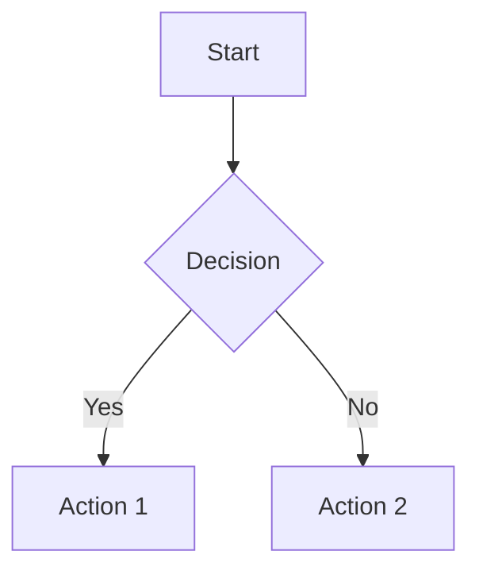

# Documentation Organization Guide

This guide explains the complete documentation structure for the EduPlayKids project, including how to navigate, maintain, and contribute to the documentation ecosystem.

## 📋 Overview

The EduPlayKids documentation is organized into multiple layers to serve different audiences and purposes:

1. **Project Documentation** - Business requirements, architecture, and design
2. **Technical Documentation** - Implementation details, APIs, and development guides
3. **User Documentation** - End-user guides and tutorials
4. **Root-Level Files** - Critical project information and contribution guidelines

## 🗂️ Complete Documentation Structure

```
EduPlayKids/
├── 📁 1.1 Documentación de Requisitos/           # ✅ COMPLETED
│   ├── 📋 PRD - EduPlayKids.md
│   ├── ⚙️ Especificaciones Funcionales - EduPlayKids.md
│   ├── 🔗 Matriz de Trazabilidad de Requisitos - EduPlayKids.md
│   ├── 👥 Análisis de Stakeholders y Usuarios Objetivo - EduPlayKids.md
│   └── 📊 Documentación de Requisitos - EduPlayKids.html
│
├── 📁 1.2 Arquitectura del Sistema/               # ✅ COMPLETED
│   ├── 🏗️ Documento de Arquitectura de Software (SAD) - EduPlayKids.md
│   ├── 📊 Diagramas de Arquitectura (C4 Model) - EduPlayKids.md
│   ├── ⚙️ Especificaciones Técnicas de Componentes - EduPlayKids.md
│   └── 📝 Decisiones Arquitectónicas (ADR) - EduPlayKids.md
│
├── 📁 1.3 Diseño de Base de Datos/                # ✅ COMPLETED
│   ├── 🗂️ Modelo Entidad-Relación (ERD) - EduPlayKids.md
│   ├── 🗄️ Esquema de Base de Datos SQLite - EduPlayKids.md
│   ├── 📖 Diccionario de Datos - EduPlayKids.md
│   └── 🔄 Scripts de Migración - EduPlayKids.md
│
├── 📁 2.1 Diseño UXUI/                           # ✅ COMPLETED
│   ├── 🗺️ user-journey-maps.md
│   ├── 📐 wireframes-pantallas.md
│   ├── 🎨 mockups-alta-fidelidad.md
│   ├── 📖 guia-estilo.md
│   ├── 🔧 sistema-diseno.md
│   └── 🌐 design-system-web.html
│
├── 📁 2.2 Especificaciones de Contenido/         # ✅ COMPLETED
│   ├── 📚 Taxonomía de Contenido Educativo.md
│   ├── 📈 Matriz de Progresión Curricular.md
│   ├── 🎯 Especificaciones de Actividades.md
│   ├── 🎨 Assets Multimedia (especificaciones).md
│   └── 🌐 Especificaciones de Contenido - EduPlayKids.html
│
├── 📁 docs/                                      # 🆕 NEW TECHNICAL DOCS
│   ├── 📄 index.md                              # Documentation homepage
│   ├── 📄 mkdocs.yml                            # Documentation site configuration
│   ├── 📄 DOCUMENTATION-ORGANIZATION.md         # This guide
│   │
│   ├── 📁 technical/                            # Technical implementation docs
│   │   ├── 📁 architecture/                    # System architecture details
│   │   │   ├── overview.md                     # ✅ Architecture overview
│   │   │   ├── clean-architecture.md           # Clean Architecture implementation
│   │   │   ├── mvvm-pattern.md                 # MVVM pattern details
│   │   │   └── dependency-injection.md         # DI container configuration
│   │   │
│   │   ├── 📁 setup-and-installation/          # Development environment setup
│   │   │   ├── development-environment.md      # Dev environment configuration
│   │   │   ├── platform-configuration.md       # Platform-specific setup
│   │   │   ├── database-setup.md               # Database configuration
│   │   │   └── localization.md                 # Bilingual setup
│   │   │
│   │   ├── 📁 api-documentation/               # API references and contracts
│   │   │   ├── domain-services.md              # Domain service interfaces
│   │   │   ├── application-services.md         # Application service APIs
│   │   │   ├── data-models.md                  # Entity and DTO definitions
│   │   │   └── infrastructure-apis.md          # Infrastructure service contracts
│   │   │
│   │   ├── 📁 development/                     # Development guidelines
│   │   │   ├── coding-standards.md             # ✅ Coding standards
│   │   │   ├── xaml-guidelines.md              # XAML best practices
│   │   │   ├── child-safe-design.md            # Child-specific design patterns
│   │   │   └── performance-guidelines.md       # Performance optimization
│   │   │
│   │   ├── 📁 testing/                         # Testing strategies and guides
│   │   │   ├── testing-strategy.md             # Overall testing approach
│   │   │   ├── unit-testing.md                 # Unit testing guidelines
│   │   │   ├── integration-testing.md          # Integration test patterns
│   │   │   └── ui-testing.md                   # UI automation testing
│   │   │
│   │   ├── 📁 deployment/                      # Build and deployment
│   │   │   ├── build-process.md                # Build configuration
│   │   │   ├── release-management.md           # Release workflow
│   │   │   ├── app-store-deployment.md         # Store deployment guide
│   │   │   └── cicd-pipeline.md                # CI/CD automation
│   │   │
│   │   ├── 📁 performance/                     # Performance optimization
│   │   │   ├── optimization-guidelines.md      # Performance best practices
│   │   │   ├── memory-management.md            # Memory optimization
│   │   │   ├── battery-optimization.md         # Mobile battery efficiency
│   │   │   └── monitoring.md                   # Performance monitoring
│   │   │
│   │   ├── 📁 security/                        # Security and privacy
│   │   │   ├── privacy-compliance.md           # COPPA/GDPR-K compliance
│   │   │   ├── child-safety.md                 # Child safety measures
│   │   │   ├── data-protection.md              # Data protection strategies
│   │   │   └── security-best-practices.md      # Security implementation
│   │   │
│   │   └── 📁 troubleshooting/                 # Problem resolution
│   │       ├── common-issues.md                # Frequently encountered issues
│   │       ├── build-problems.md               # Build and compilation issues
│   │       ├── platform-specific-issues.md     # Platform-specific problems
│   │       └── performance-issues.md           # Performance troubleshooting
│   │
│   ├── 📁 user/                                # End-user documentation
│   │   ├── user-guide.md                       # Application user guide
│   │   ├── parent-guide.md                     # Parental controls guide
│   │   └── educational-content.md              # Educational content overview
│   │
│   ├── 📁 contributing/                        # Contribution guidelines
│   │   ├── how-to-contribute.md                # Contribution process
│   │   ├── code-of-conduct.md                  # Community guidelines
│   │   └── development-workflow.md             # Development process
│   │
│   └── 📁 assets/                              # Documentation assets
│       ├── 📁 images/                          # Screenshots, diagrams
│       └── 📁 diagrams/                        # Architecture diagrams
│
├── 📄 README.md                                 # ✅ Project overview and quick start
├── 📄 INSTALL.md                               # ✅ Installation instructions
├── 📄 CONTRIBUTING.md                          # ✅ Contribution guidelines
├── 📄 CLAUDE.md                                # ✅ Claude Code instructions
└── 📄 instrucciones.md                         # ✅ Original requirements
```

## 🎯 Documentation Audiences

### 1. 👨‍💼 Project Stakeholders
**Primary Documentation:**
- [PRD - EduPlayKids.md](../1.1%20Documentación%20de%20Requisitos/PRD%20-%20EduPlayKids.md) - Product requirements and business model
- [Análisis de Stakeholders y Usuarios Objetivo](../1.1%20Documentación%20de%20Requisitos/Análisis%20de%20Stakeholders%20y%20Usuarios%20Objetivo%20-%20EduPlayKids.md) - Market analysis
- [README.md](../README.md) - Project overview and status

**Use Cases:**
- Understanding business requirements and market opportunity
- Reviewing project progress and milestones
- Making strategic decisions about features and timeline

### 2. 🏗️ System Architects & Tech Leads
**Primary Documentation:**
- [Documento de Arquitectura de Software (SAD)](../1.2%20Arquitectura%20del%20Sistema/Documento%20de%20Arquitectura%20de%20Software%20(SAD)%20-%20EduPlayKids.md) - Complete architecture
- [docs/technical/architecture/overview.md](technical/architecture/overview.md) - Technical architecture details
- [Decisiones Arquitectónicas (ADR)](../1.2%20Arquitectura%20del%20Sistema/Decisiones%20Arquitectónicas%20(ADR)%20-%20EduPlayKids.md) - Architecture decisions

**Use Cases:**
- Understanding system design and architectural patterns
- Making technical decisions and evaluating trade-offs
- Planning technical implementation strategy

### 3. 💻 Software Developers
**Primary Documentation:**
- [INSTALL.md](../INSTALL.md) - Development environment setup
- [docs/technical/development/coding-standards.md](technical/development/coding-standards.md) - Coding guidelines
- [docs/technical/api-documentation/](technical/api-documentation/) - API references
- [CONTRIBUTING.md](../CONTRIBUTING.md) - Contribution process

**Use Cases:**
- Setting up development environment
- Understanding coding standards and best practices
- Implementing new features following established patterns
- Writing tests and documentation

### 4. 🎨 UX/UI Designers
**Primary Documentation:**
- [sistema-diseno.md](../2.1%20Diseño%20UXUI/sistema-diseno.md) - Design system
- [guia-estilo.md](../2.1%20Diseño%20UXUI/guia-estilo.md) - Style guide
- [docs/technical/development/child-safe-design.md](technical/development/child-safe-design.md) - Child-specific design patterns

**Use Cases:**
- Understanding design system and visual guidelines
- Creating child-friendly interfaces
- Ensuring accessibility and age-appropriate design

### 5. 📊 Quality Assurance
**Primary Documentation:**
- [Matriz de Trazabilidad de Requisitos](../1.1%20Documentación%20de%20Requisitos/Matriz%20de%20Trazabilidad%20de%20Requisitos%20-%20EduPlayKids.md) - Requirements traceability
- [docs/technical/testing/](technical/testing/) - Testing strategies
- [Especificaciones Funcionales](../1.1%20Documentación%20de%20Requisitos/Especificaciones%20Funcionales%20-%20EduPlayKids.md) - Functional requirements

**Use Cases:**
- Understanding testing requirements and strategies
- Creating test plans and test cases
- Ensuring quality standards and compliance

### 6. 📚 Educational Content Creators
**Primary Documentation:**
- [Taxonomía de Contenido Educativo](../2.2%20Especificaciones%20de%20Contenido/Taxonomía%20de%20Contenido%20Educativo.md) - Content taxonomy
- [Matriz de Progresión Curricular](../2.2%20Especificaciones%20de%20Contenido/Matriz%20de%20Progresión%20Curricular.md) - Learning progression
- [Especificaciones de Actividades](../2.2%20Especificaciones%20de%20Contenido/Especificaciones%20de%20Actividades.md) - Activity specifications

**Use Cases:**
- Understanding educational framework and curriculum alignment
- Creating age-appropriate content and activities
- Ensuring content meets learning objectives

### 7. 👨‍👩‍👧‍👦 End Users (Parents & Children)
**Primary Documentation:**
- [docs/user/user-guide.md](user/user-guide.md) - Application usage guide
- [docs/user/parent-guide.md](user/parent-guide.md) - Parental controls
- [README.md](../README.md) - Quick overview and features

**Use Cases:**
- Learning how to use the application
- Understanding parental controls and settings
- Getting help with common issues

## 📖 Documentation Types and Standards

### 1. Requirements Documentation (Phase 1 ✅)
- **Format**: Markdown with HTML consolidated views
- **Language**: Spanish (primary target market)
- **Purpose**: Business requirements, functional specifications, stakeholder analysis
- **Maintenance**: Updated during requirement changes only

### 2. Architecture Documentation (Phase 2 ✅)
- **Format**: Markdown with Mermaid diagrams
- **Language**: Spanish with technical English terms
- **Purpose**: System design, technical architecture, component specifications
- **Maintenance**: Updated when architecture changes

### 3. Database Documentation (Phase 2.5 ✅)
- **Format**: Markdown with SQL scripts
- **Language**: Spanish documentation, English code
- **Purpose**: Data model, schema design, migration scripts
- **Maintenance**: Updated with each database schema change

### 4. UX/UI Documentation (Phase 3 ✅)
- **Format**: Markdown with HTML interactive components
- **Language**: Spanish with design system in multiple languages
- **Purpose**: User experience design, visual design system, wireframes
- **Maintenance**: Updated when design system changes

### 5. Content Documentation (Phase 3.5 ✅)
- **Format**: Markdown with YAML specifications
- **Language**: Spanish with bilingual content specifications
- **Purpose**: Educational content organization, curriculum alignment
- **Maintenance**: Updated when educational content changes

### 6. Technical Documentation (New 🆕)
- **Format**: Markdown with MkDocs generation
- **Language**: English (developer-focused)
- **Purpose**: Implementation details, APIs, development guides
- **Maintenance**: Updated continuously during development

## 🔧 Documentation Tools and Workflows

### MkDocs Configuration
The new technical documentation uses MkDocs for static site generation:

```bash
# Install MkDocs and required plugins
pip install mkdocs mkdocs-material

# Serve documentation locally
cd docs/
mkdocs serve

# Build static site
mkdocs build

# Deploy to GitHub Pages
mkdocs gh-deploy
```

### Documentation Standards

#### Markdown Guidelines
```markdown
# H1 - Page Title (one per document)
## H2 - Major Sections
### H3 - Subsections
#### H4 - Details (avoid deeper nesting)

- Use bullet points for lists
- Use numbered lists for sequential steps
- Use `code` for inline code
- Use ```language blocks for code examples
- Use **bold** for emphasis
- Use *italic* for subtle emphasis

> Use blockquotes for important notes

!!! note "Admonitions for special content"
    Use MkDocs admonitions for warnings, tips, etc.
```

#### Code Documentation
```csharp
/// <summary>
/// All public APIs must have XML documentation
/// Following Microsoft documentation standards
/// </summary>
/// <param name="parameter">Parameter description</param>
/// <returns>Return value description</returns>
/// <exception cref="ExceptionType">When exception is thrown</exception>
public async Task<Result> MethodAsync(Parameter parameter)
```

#### Diagram Standards
Use Mermaid for diagrams:


## 🔄 Documentation Maintenance Workflow

### 1. Continuous Updates (Technical Docs)
- **Trigger**: Code changes, new features, bug fixes
- **Frequency**: With each pull request
- **Responsibility**: Development team
- **Process**: Update docs as part of feature development

### 2. Periodic Reviews (All Documentation)
- **Frequency**: Monthly
- **Responsibility**: Tech Lead + Product Owner
- **Process**: Review documentation accuracy and completeness

### 3. Version Management
- **Documentation versioning**: Aligned with application releases
- **Legacy documentation**: Maintained for supported versions
- **Archive policy**: Archive documentation for EOL versions

### 4. Quality Assurance
- **Link checking**: Automated link validation
- **Content review**: Manual review for accuracy
- **User feedback**: Incorporate feedback from documentation users

## 📚 Documentation Generation Commands

### Local Development
```bash
# Serve technical documentation
cd docs/
mkdocs serve --dev-addr 127.0.0.1:8000

# Build consolidated HTML views (existing docs)
# (Custom scripts for existing documentation)
python scripts/build-consolidated-docs.py

# Check documentation links
mkdocs build --strict
```

### CI/CD Integration
```yaml
# GitHub Actions workflow for documentation
name: Documentation
on:
  push:
    branches: [main]
    paths: ['docs/**', '*.md']

jobs:
  deploy:
    runs-on: ubuntu-latest
    steps:
      - uses: actions/checkout@v3
      - uses: actions/setup-python@v4
        with:
          python-version: 3.x
      - run: pip install mkdocs-material
      - run: mkdocs gh-deploy --force
```

## 🎯 Best Practices for Documentation Contributors

### 1. Writing Guidelines
- **Audience-first**: Write for your specific audience
- **Clarity**: Use simple, clear language
- **Completeness**: Include all necessary information
- **Examples**: Provide concrete examples and code samples
- **Consistency**: Follow established patterns and styles

### 2. Child-Safety Considerations
- **Privacy**: Never include personal information in examples
- **Language**: Use child-friendly language in user-facing docs
- **Safety**: Emphasize child safety features and considerations
- **Compliance**: Ensure all documentation reflects COPPA/GDPR-K compliance

### 3. Multilingual Considerations
- **Primary Language**: Spanish for business docs, English for technical docs
- **Translations**: Maintain consistency across languages
- **Cultural Adaptation**: Consider cultural context for Hispanic families
- **Technical Terms**: Use standard English technical terms with Spanish explanations

### 4. Accessibility
- **Structure**: Use proper heading hierarchy
- **Alt Text**: Include alt text for images
- **Contrast**: Ensure good color contrast in visual elements
- **Screen Readers**: Write content that works well with screen readers

## 🔍 Finding Information

### Quick Reference Guide

| I need to... | Look here... |
|-------------|--------------|
| Understand the business requirements | [PRD - EduPlayKids.md](../1.1%20Documentación%20de%20Requisitos/PRD%20-%20EduPlayKids.md) |
| Set up development environment | [INSTALL.md](../INSTALL.md) |
| Understand the architecture | [docs/technical/architecture/overview.md](technical/architecture/overview.md) |
| Learn coding standards | [docs/technical/development/coding-standards.md](technical/development/coding-standards.md) |
| See the database design | [Esquema de Base de Datos SQLite](../1.3%20Diseño%20de%20Base%20de%20Datos/Esquema%20de%20Base%20de%20Datos%20SQLite%20-%20EduPlayKids.md) |
| Understand the design system | [sistema-diseno.md](../2.1%20Diseño%20UXUI/sistema-diseno.md) |
| Contribute to the project | [CONTRIBUTING.md](../CONTRIBUTING.md) |
| Find educational content specs | [Taxonomía de Contenido Educativo](../2.2%20Especificaciones%20de%20Contenido/Taxonomía%20de%20Contenido%20Educativo.md) |
| Troubleshoot issues | [docs/technical/troubleshooting/](technical/troubleshooting/) |
| Learn about testing | [docs/technical/testing/](technical/testing/) |

### Search Strategy
1. **Start with README.md** for project overview
2. **Check specific phase documentation** for detailed requirements
3. **Use technical docs** for implementation details
4. **Reference troubleshooting** for problem resolution
5. **Consult CONTRIBUTING.md** for process questions

## 📞 Documentation Support

### Getting Help
- **GitHub Issues**: For documentation bugs or missing information
- **GitHub Discussions**: For documentation questions and suggestions
- **Team Contact**: [documentation@eduplaykids.com](mailto:documentation@eduplaykids.com)

### Contributing to Documentation
1. Read [CONTRIBUTING.md](../CONTRIBUTING.md)
2. Create feature branch for documentation changes
3. Follow documentation standards and guidelines
4. Test documentation changes locally
5. Submit pull request with clear description

---

**🎓 This documentation organization ensures comprehensive coverage of all project aspects while maintaining clarity and accessibility for all stakeholders.**

*Last updated: September 2024 | Maintained by: EduPlayKids Development Team*