# Architecture Overview

This document provides a comprehensive overview of the EduPlayKids system architecture, designed following Clean Architecture principles with MVVM pattern for the presentation layer.

## 🏗️ Architectural Principles

### Clean Architecture
The application follows Uncle Bob's Clean Architecture principles, organizing code into distinct layers with clear dependency rules:

1. **Dependencies point inward**: Outer layers depend on inner layers, never the reverse
2. **Domain-centric**: Business logic is independent of frameworks and external concerns
3. **Testable**: Each layer can be tested in isolation
4. **Framework-independent**: Core business logic doesn't depend on .NET MAUI or any framework

### MVVM Pattern
The presentation layer implements the Model-View-ViewModel pattern:

- **Views**: XAML-based UI components optimized for children aged 3-8
- **ViewModels**: Handle UI logic, data binding, and command execution
- **Models**: Data transfer objects and view-specific data structures

## 📐 Layer Architecture

```mermaid
graph TB
    subgraph "🎨 Presentation Layer"
        direction TB
        V[📱 Views<br/>XAML Pages & Controls]
        VM[🎛️ ViewModels<br/>UI Logic & Binding]
        C[🔧 Converters & Behaviors<br/>UI Helpers]

        V --> VM
        VM --> C
    end

    subgraph "🔄 Application Layer"
        direction TB
        UC[⚙️ Use Cases<br/>Application Business Rules]
        AS[🎯 Application Services<br/>Orchestration Logic]
        DTO[📦 DTOs & Commands<br/>Data Transfer Objects]
        I1[🔌 Interfaces<br/>Service Contracts]

        UC --> AS
        AS --> DTO
        UC --> I1
    end

    subgraph "💎 Domain Layer"
        direction TB
        E[🏢 Entities<br/>Child, Activity, Progress]
        VO[💧 Value Objects<br/>Age, Score, Level]
        DS[🧠 Domain Services<br/>Business Logic]
        I2[🔌 Domain Interfaces<br/>Repository Contracts]

        E --> VO
        DS --> E
        DS --> I2
    end

    subgraph "🔧 Infrastructure Layer"
        direction TB
        R[📚 Repositories<br/>Data Access]
        EF[🗄️ Entity Framework<br/>ORM Configuration]
        DB[(🗃️ SQLite Database<br/>Local Storage)]
        FS[📁 File System<br/>Asset Management]
        AU[🔊 Audio Services<br/>Sound Playback]

        R --> EF
        EF --> DB
        R --> FS
        AU --> FS
    end

    VM --> UC
    UC --> DS
    UC --> R
    I1 -.-> R
    I2 -.-> R
    VM --> AU

    classDef presentationStyle fill:#e1f5fe,stroke:#0277bd,stroke-width:2px
    classDef applicationStyle fill:#f3e5f5,stroke:#7b1fa2,stroke-width:2px
    classDef domainStyle fill:#e8f5e8,stroke:#388e3c,stroke-width:2px
    classDef infrastructureStyle fill:#fff3e0,stroke:#f57c00,stroke-width:2px

    class V,VM,C presentationStyle
    class UC,AS,DTO,I1 applicationStyle
    class E,VO,DS,I2 domainStyle
    class R,EF,DB,FS,AU infrastructureStyle
```



## 🎯 Layer Responsibilities

### 1. Domain Layer (Core)
**Location**: `src/EduPlayKids.Domain/`

**Responsibilities**:
- Core business entities (Child, Activity, Progress, Achievement)
- Business rules and domain logic
- Value objects for type safety (Age, Score, Difficulty)
- Domain service interfaces
- No external dependencies

**Key Components**:
```csharp
// Entities
public class Child : BaseEntity
{
    public string Name { get; private set; }
    public Age Age { get; private set; }
    public List<Progress> ProgressHistory { get; private set; }

    public bool CanAccessActivity(Activity activity) =>
        activity.MinimumAge <= Age && HasCompletedPrerequisites(activity);
}

// Value Objects
public record Age(int Years, int Months)
{
    public static Age FromYears(int years) => new(years, 0);
    public bool IsAtLeast(Age minimum) =>
        Years > minimum.Years || (Years == minimum.Years && Months >= minimum.Months);
}
```

### 2. Application Layer
**Location**: `src/EduPlayKids.Application/`

**Responsibilities**:
- Use cases and application business rules
- Orchestration of domain objects
- Application services
- DTOs for data transfer
- Command and query handling

**Key Components**:
```csharp
// Use Cases
public class StartActivityUseCase
{
    public async Task<ActivityResult> ExecuteAsync(StartActivityCommand command)
    {
        var child = await _childRepository.GetByIdAsync(command.ChildId);
        var activity = await _activityRepository.GetByIdAsync(command.ActivityId);

        if (!child.CanAccessActivity(activity))
            return ActivityResult.AccessDenied();

        return ActivityResult.Success(activity);
    }
}

// Application Services
public class ProgressTrackingService
{
    public async Task<ProgressResult> RecordProgressAsync(RecordProgressCommand command);
    public async Task<ProgressSummary> GetProgressSummaryAsync(int childId);
}
```

### 3. Infrastructure Layer
**Location**: `src/EduPlayKids.Infrastructure/`

**Responsibilities**:
- Data access implementation
- External service integrations
- File system operations
- Audio playback services
- Database configuration

**Key Components**:
```csharp
// Repository Implementation
public class ChildRepository : IChildRepository
{
    private readonly EduPlayKidsDbContext _context;

    public async Task<Child> GetByIdAsync(int id) =>
        await _context.Children
            .Include(c => c.ProgressHistory)
            .FirstOrDefaultAsync(c => c.Id == id);
}

// Database Context
public class EduPlayKidsDbContext : DbContext
{
    public DbSet<Child> Children { get; set; }
    public DbSet<Activity> Activities { get; set; }
    public DbSet<Progress> ProgressRecords { get; set; }
}
```

### 4. Presentation Layer
**Location**: `src/EduPlayKids.Presentation/`

**Responsibilities**:
- XAML-based user interface
- ViewModels for data binding
- Navigation and routing
- Platform-specific UI implementations
- Child-friendly interaction patterns

**Key Components**:
```csharp
// ViewModel
public partial class MathematicsViewModel : BaseViewModel
{
    [ObservableProperty] private ObservableCollection<ActivityViewModel> _activities;
    [ObservableProperty] private ChildViewModel _currentChild;

    [RelayCommand]
    private async Task StartActivityAsync(ActivityViewModel activity)
    {
        var result = await _startActivityUseCase.ExecuteAsync(
            new StartActivityCommand(CurrentChild.Id, activity.Id));

        if (result.IsSuccess)
            await NavigateToActivityAsync(activity);
    }
}
```

## 🔄 Data Flow

### Command Flow (User Actions)
1. **User Interaction**: Child taps on activity button
2. **View**: Captures touch event, triggers command
3. **ViewModel**: Executes RelayCommand, calls use case
4. **Use Case**: Validates business rules, calls domain services
5. **Domain Service**: Applies business logic, calls repositories
6. **Repository**: Persists data, returns result
7. **Response**: Flows back through layers to update UI

### Query Flow (Data Retrieval)
1. **ViewModel**: Requests data for binding
2. **Use Case**: Orchestrates data retrieval
3. **Repository**: Fetches data from SQLite
4. **Mapping**: Converts entities to DTOs/ViewModels
5. **Binding**: Updates UI through MVVM data binding

## 🔌 Dependency Injection

### Service Registration
```csharp
// MauiProgram.cs
public static MauiApp CreateMauiApp()
{
    var builder = MauiApp.CreateBuilder();

    // Domain Services
    builder.Services.AddScoped<IChildDomainService, ChildDomainService>();
    builder.Services.AddScoped<IProgressDomainService, ProgressDomainService>();

    // Application Services
    builder.Services.AddScoped<IStartActivityUseCase, StartActivityUseCase>();
    builder.Services.AddScoped<IProgressTrackingService, ProgressTrackingService>();

    // Infrastructure Services
    builder.Services.AddScoped<IChildRepository, ChildRepository>();
    builder.Services.AddScoped<IActivityRepository, ActivityRepository>();
    builder.Services.AddSingleton<IAudioService, AudioService>();

    // ViewModels
    builder.Services.AddTransient<MathematicsViewModel>();
    builder.Services.AddTransient<ReadingViewModel>();

    return builder.Build();
}
```

## 🎨 Child-Specific Architectural Considerations

### Large Touch Targets
- Minimum 60dp touch targets for children aged 3-8
- Extra spacing between interactive elements
- Visual feedback for all touch interactions

### Audio-First Design
- Audio instructions for non-readers
- Consistent audio feedback patterns
- Bilingual audio support (Spanish/English)

### Offline-First Architecture
- Local SQLite database for all user data
- Embedded educational content
- No network dependencies after installation

### Progressive Complexity
- Age-appropriate activity filtering
- Mastery-based progression system
- Adaptive difficulty adjustment

## 📊 Performance Considerations

### Memory Management
- Lazy loading of activities and content
- Image optimization for mobile devices
- Proper disposal of audio resources

### Database Optimization
- Indexed queries for progress tracking
- Efficient relationship loading
- Batch operations for bulk data

### UI Responsiveness
- Async/await patterns throughout
- Background processing for non-UI operations
- Smooth animations (300ms max duration)

## 🔒 Security Architecture

### Privacy by Design
- Local-only data storage
- No external communication
- COPPA and GDPR-K compliance

### Data Protection
- Encrypted sensitive data
- Secure key management
- Parental control PIN protection

## 🧪 Testing Architecture

### Unit Testing Strategy
- Domain layer: 95% coverage
- Application layer: 90% coverage
- Infrastructure layer: 80% coverage
- Presentation layer: 70% coverage (ViewModels)

### Test Organization
```
tests/
├── EduPlayKids.Domain.Tests/
│   ├── Entities/
│   ├── ValueObjects/
│   └── Services/
├── EduPlayKids.Application.Tests/
│   ├── UseCases/
│   └── Services/
├── EduPlayKids.Infrastructure.Tests/
│   ├── Repositories/
│   └── Database/
└── EduPlayKids.Presentation.Tests/
    ├── ViewModels/
    └── Integration/
```

## 📱 Platform-Specific Considerations

### Android (Primary Target)
- **Minimum API**: 21 (Android 5.0)
- **Target API**: 33 (Android 13)
- **Architecture**: ARM64, x86_64
- **Permissions**: Minimal required permissions only

### iOS (Future Support)
- **Minimum Version**: iOS 12.0
- **Target Version**: Latest available
- **Architecture**: ARM64
- **Privacy**: App Store privacy compliance

## 🔄 Future Architecture Evolution

### Scalability Considerations
- Modular architecture for feature expansion
- Plugin system for educational modules
- Content management system integration
- Multi-language content support

### Technology Roadmap
- .NET 9 migration plan
- Enhanced offline synchronization
- Advanced analytics (privacy-compliant)
- Accessibility improvements

---

**Next**: [Clean Architecture Details](clean-architecture.md) | [MVVM Implementation](mvvm-pattern.md)