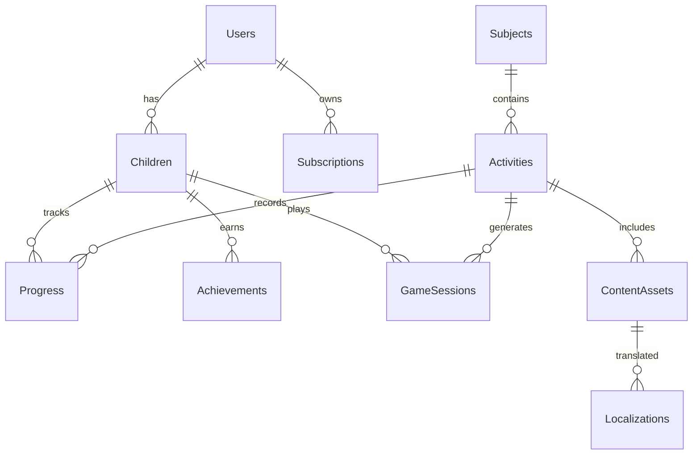

# Database Setup Documentation

This comprehensive guide covers the setup, configuration, and management of the SQLite database for the EduPlayKids application. The database is designed with offline-first principles and child data privacy in mind.

## 📋 Database Overview

### Technology Stack
- **Database Engine**: SQLite 3.x
- **ORM Framework**: Entity Framework Core 8.x
- **Migration Strategy**: Code-First with Entity Framework Migrations
- **Data Storage**: Local device storage (no cloud synchronization)
- **Privacy Compliance**: COPPA and GDPR-K compliant data handling

### Key Design Principles
- **Offline-First**: Complete functionality without internet connection
- **Child Privacy**: Minimal personal data collection and storage
- **Performance**: Optimized for mobile device constraints
- **Multilingual**: Support for Spanish and English content
- **Educational Focus**: Structured for learning progression and assessment

## 🗄️ Database Schema Overview

### Core Entities (12 Tables)
```
📊 Database Schema:
├── 👥 Users (Parents/Guardians)
├── 👶 Children (Child Profiles)
├── 📚 Subjects (Educational Areas)
├── 🎯 Activities (Learning Activities)
├── 📊 Progress (Learning Progress Tracking)
├── 🏆 Achievements (Gamification Rewards)
├── 💰 Subscriptions (Premium Access)
├── 🎵 ContentAssets (Multimedia Content)
├── 🌐 Localizations (Multi-language Support)
├── ⚙️ Settings (Application Configuration)
├── 📈 Analytics (Privacy-Safe Metrics)
└── 🎮 GameSessions (Activity Session Data)
```

### Entity Relationships


## 🛠️ Entity Framework Core Setup

### DbContext Configuration

#### Primary Database Context
```csharp
// EduPlayKidsDbContext.cs
public class EduPlayKidsDbContext : DbContext
{
    // DbSet Properties
    public DbSet<User> Users { get; set; }
    public DbSet<Child> Children { get; set; }
    public DbSet<Subject> Subjects { get; set; }
    public DbSet<Activity> Activities { get; set; }
    public DbSet<Progress> ProgressRecords { get; set; }
    public DbSet<Achievement> Achievements { get; set; }
    public DbSet<Subscription> Subscriptions { get; set; }
    public DbSet<ContentAsset> ContentAssets { get; set; }
    public DbSet<Localization> Localizations { get; set; }
    public DbSet<Setting> Settings { get; set; }
    public DbSet<AnalyticsEvent> AnalyticsEvents { get; set; }
    public DbSet<GameSession> GameSessions { get; set; }

    protected override void OnConfiguring(DbContextOptionsBuilder optionsBuilder)
    {
        if (!optionsBuilder.IsConfigured)
        {
            var dbPath = GetDatabasePath();
            optionsBuilder.UseSqlite($"Data Source={dbPath}");

            // Performance optimizations for mobile
            optionsBuilder.EnableSensitiveDataLogging(false);
            optionsBuilder.EnableServiceProviderCaching(true);
        }
    }

    protected override void OnModelCreating(ModelBuilder modelBuilder)
    {
        // Apply all entity configurations
        modelBuilder.ApplyConfigurationsFromAssembly(typeof(EduPlayKidsDbContext).Assembly);

        // Configure global filters for child safety
        modelBuilder.Entity<Child>().HasQueryFilter(c => c.IsActive);
        modelBuilder.Entity<Activity>().HasQueryFilter(a => a.IsPublished);

        // Seed initial data
        SeedInitialData(modelBuilder);
    }

    private static string GetDatabasePath()
    {
        var documentsPath = Environment.GetFolderPath(Environment.SpecialFolder.LocalApplicationData);
        return Path.Combine(documentsPath, "eduplaykids.db");
    }
}
```

#### Connection String Configuration
```json
// appsettings.json
{
  "ConnectionStrings": {
    "DefaultConnection": "Data Source=eduplaykids.db",
    "DevelopmentConnection": "Data Source=eduplaykids_dev.db"
  },
  "DatabaseSettings": {
    "EnableLogging": false,
    "CommandTimeout": 30,
    "RetryCount": 3,
    "MaxBatchSize": 100
  }
}
```

### Entity Configurations

#### Child Entity Configuration
```csharp
// Configurations/ChildConfiguration.cs
public class ChildConfiguration : IEntityTypeConfiguration<Child>
{
    public void Configure(EntityTypeBuilder<Child> builder)
    {
        builder.ToTable("Children");

        // Primary Key
        builder.HasKey(c => c.Id);

        // Properties
        builder.Property(c => c.Name)
            .IsRequired()
            .HasMaxLength(50)
            .HasComment("Child's display name (encrypted)");

        // Value Object: Age
        builder.OwnsOne(c => c.Age, age =>
        {
            age.Property(a => a.Years)
                .HasColumnName("AgeYears")
                .HasComment("Child's age in years (3-8)");

            age.Property(a => a.Months)
                .HasColumnName("AgeMonths")
                .HasComment("Additional months (0-11)");
        });

        // Enum Properties
        builder.Property(c => c.PreferredLanguage)
            .HasConversion<string>()
            .HasMaxLength(10);

        // Audit Fields
        builder.Property(c => c.CreatedAt)
            .HasDefaultValueSql("datetime('now')")
            .HasComment("Record creation timestamp");

        builder.Property(c => c.UpdatedAt)
            .HasDefaultValueSql("datetime('now')")
            .HasComment("Record last update timestamp");

        // Relationships
        builder.HasOne(c => c.User)
            .WithMany(u => u.Children)
            .HasForeignKey(c => c.UserId)
            .OnDelete(DeleteBehavior.Cascade);

        builder.HasMany(c => c.ProgressRecords)
            .WithOne(p => p.Child)
            .HasForeignKey(p => p.ChildId)
            .OnDelete(DeleteBehavior.Cascade);

        builder.HasMany(c => c.Achievements)
            .WithOne(a => a.Child)
            .HasForeignKey(a => a.ChildId)
            .OnDelete(DeleteBehavior.Cascade);

        // Indexes for performance
        builder.HasIndex(c => c.UserId)
            .HasDatabaseName("IX_Children_UserId");

        builder.HasIndex(c => new { c.UserId, c.IsActive })
            .HasDatabaseName("IX_Children_User_Active");

        // Child Safety: Soft delete
        builder.Property(c => c.IsActive)
            .HasDefaultValue(true);
    }
}
```

#### Activity Entity Configuration
```csharp
// Configurations/ActivityConfiguration.cs
public class ActivityConfiguration : IEntityTypeConfiguration<Activity>
{
    public void Configure(EntityTypeBuilder<Activity> builder)
    {
        builder.ToTable("Activities");

        builder.HasKey(a => a.Id);

        // Properties
        builder.Property(a => a.Title)
            .IsRequired()
            .HasMaxLength(100);

        builder.Property(a => a.Description)
            .HasMaxLength(500);

        builder.Property(a => a.InstructionKey)
            .IsRequired()
            .HasMaxLength(100)
            .HasComment("Key for localized audio instructions");

        // Value Objects
        builder.OwnsOne(a => a.MinimumAge, age =>
        {
            age.Property(a => a.Years).HasColumnName("MinimumAgeYears");
            age.Property(a => a.Months).HasColumnName("MinimumAgeMonths");
        });

        builder.OwnsOne(a => a.MaximumAge, age =>
        {
            age.Property(a => a.Years).HasColumnName("MaximumAgeYears");
            age.Property(a => a.Months).HasColumnName("MaximumAgeMonths");
        });

        // Enums
        builder.Property(a => a.ActivityType)
            .HasConversion<string>()
            .HasMaxLength(50);

        builder.Property(a => a.DifficultyLevel)
            .HasConversion<string>()
            .HasMaxLength(20);

        // JSON Column for activity configuration
        builder.Property(a => a.Configuration)
            .HasColumnType("TEXT")
            .HasConversion(
                v => JsonSerializer.Serialize(v, (JsonSerializerOptions?)null),
                v => JsonSerializer.Deserialize<ActivityConfiguration>(v, (JsonSerializerOptions?)null))
            .HasComment("Activity-specific configuration as JSON");

        // Relationships
        builder.HasOne(a => a.Subject)
            .WithMany(s => s.Activities)
            .HasForeignKey(a => a.SubjectId)
            .OnDelete(DeleteBehavior.Restrict);

        builder.HasMany(a => a.ContentAssets)
            .WithOne(ca => ca.Activity)
            .HasForeignKey(ca => ca.ActivityId)
            .OnDelete(DeleteBehavior.Cascade);

        builder.HasMany(a => a.Prerequisites)
            .WithMany(a => a.UnlockedActivities)
            .UsingEntity(
                "ActivityPrerequisites",
                l => l.HasOne(typeof(Activity)).WithMany().HasForeignKey("PrerequisiteId"),
                r => r.HasOne(typeof(Activity)).WithMany().HasForeignKey("ActivityId"),
                je => je.HasKey("ActivityId", "PrerequisiteId"));

        // Indexes
        builder.HasIndex(a => a.SubjectId);
        builder.HasIndex(a => new { a.ActivityType, a.DifficultyLevel });
        builder.HasIndex(a => new { a.MinimumAgeYears, a.IsPublished });
        builder.HasIndex(a => a.SortOrder);
    }
}
```

#### Progress Entity Configuration
```csharp
// Configurations/ProgressConfiguration.cs
public class ProgressConfiguration : IEntityTypeConfiguration<Progress>
{
    public void Configure(EntityTypeBuilder<Progress> builder)
    {
        builder.ToTable("Progress");

        builder.HasKey(p => p.Id);

        // Value Objects
        builder.OwnsOne(p => p.Score, score =>
        {
            score.Property(s => s.Points)
                .HasColumnName("ScorePoints")
                .HasComment("Points earned (0-100)");

            score.Property(s => s.Stars)
                .HasColumnName("ScoreStars")
                .HasComment("Stars earned (1-3)");

            score.Property(s => s.Percentage)
                .HasColumnName("ScorePercentage")
                .HasPrecision(5, 2)
                .HasComment("Percentage score (0.00-100.00)");
        });

        // Performance Metrics
        builder.Property(p => p.TimeSpent)
            .HasComment("Time spent in seconds");

        builder.Property(p => p.AttemptsCount)
            .HasDefaultValue(1)
            .HasComment("Number of attempts for this activity");

        builder.Property(p => p.HintsUsed)
            .HasDefaultValue(0)
            .HasComment("Number of hints used");

        // JSON Column for detailed progress data
        builder.Property(p => p.DetailedResults)
            .HasColumnType("TEXT")
            .HasConversion(
                v => JsonSerializer.Serialize(v, (JsonSerializerOptions?)null),
                v => JsonSerializer.Deserialize<Dictionary<string, object>>(v, (JsonSerializerOptions?)null))
            .HasComment("Detailed activity results as JSON");

        // Timestamps
        builder.Property(p => p.CompletedAt)
            .HasDefaultValueSql("datetime('now')");

        // Relationships
        builder.HasOne(p => p.Child)
            .WithMany(c => c.ProgressRecords)
            .HasForeignKey(p => p.ChildId)
            .OnDelete(DeleteBehavior.Cascade);

        builder.HasOne(p => p.Activity)
            .WithMany()
            .HasForeignKey(p => p.ActivityId)
            .OnDelete(DeleteBehavior.Restrict);

        // Indexes for performance queries
        builder.HasIndex(p => p.ChildId);
        builder.HasIndex(p => p.ActivityId);
        builder.HasIndex(p => new { p.ChildId, p.ActivityId, p.CompletedAt });
        builder.HasIndex(p => p.CompletedAt);

        // Constraints
        builder.HasCheckConstraint("CK_Progress_TimeSpent", "TimeSpent >= 0");
        builder.HasCheckConstraint("CK_Progress_AttemptsCount", "AttemptsCount > 0");
    }
}
```

## 🔧 Database Initialization

### Step 1: Install Required Packages

```xml
<!-- In EduPlayKids.Infrastructure.csproj -->
<PackageReference Include="Microsoft.EntityFrameworkCore.Sqlite" Version="8.0.0" />
<PackageReference Include="Microsoft.EntityFrameworkCore.Tools" Version="8.0.0" />
<PackageReference Include="Microsoft.EntityFrameworkCore.Design" Version="8.0.0" />
```

### Step 2: Configure Dependency Injection

```csharp
// MauiProgram.cs
public static class MauiProgram
{
    public static MauiApp CreateMauiApp()
    {
        var builder = MauiApp.CreateBuilder();

        // Database Configuration
        builder.Services.AddDbContext<EduPlayKidsDbContext>(options =>
        {
            var dbPath = Path.Combine(
                Environment.GetFolderPath(Environment.SpecialFolder.LocalApplicationData),
                "eduplaykids.db");

            options.UseSqlite($"Data Source={dbPath}");

            // Development settings
#if DEBUG
            options.EnableSensitiveDataLogging(true);
            options.EnableDetailedErrors(true);
#endif
        });

        // Repository Pattern
        builder.Services.AddScoped<IUnitOfWork, UnitOfWork>();
        builder.Services.AddScoped<IChildRepository, ChildRepository>();
        builder.Services.AddScoped<IActivityRepository, ActivityRepository>();
        builder.Services.AddScoped<IProgressRepository, ProgressRepository>();

        return builder.Build();
    }
}
```

### Step 3: Create Initial Migration

```bash
# Navigate to infrastructure project
cd app/src/EduPlayKids.Infrastructure

# Add Entity Framework Tools (if not installed globally)
dotnet tool install --global dotnet-ef

# Create initial migration
dotnet ef migrations add InitialCreate \
    --startup-project ../EduPlayKids.Presentation \
    --output-dir Database/Migrations

# Review generated migration files
ls Database/Migrations/
```

### Step 4: Apply Migration and Create Database

```bash
# Update database with migration
dotnet ef database update \
    --startup-project ../EduPlayKids.Presentation

# Verify database was created
ls $HOME/.local/share/ | grep eduplaykids
# Should show: eduplaykids.db
```

## 🌱 Data Seeding Strategy

### Educational Content Seeding

```csharp
// Database/Seeders/DatabaseSeeder.cs
public static class DatabaseSeeder
{
    public static async Task SeedAsync(EduPlayKidsDbContext context)
    {
        // Ensure database is created
        await context.Database.EnsureCreatedAsync();

        // Seed in dependency order
        await SeedSubjectsAsync(context);
        await SeedActivitiesAsync(context);
        await SeedContentAssetsAsync(context);
        await SeedLocalizationsAsync(context);
        await SeedAchievementsAsync(context);

        await context.SaveChangesAsync();
    }

    private static async Task SeedSubjectsAsync(EduPlayKidsDbContext context)
    {
        if (await context.Subjects.AnyAsync()) return;

        var subjects = new[]
        {
            new Subject
            {
                Name = "Mathematics",
                Description = "Numbers, counting, and basic math skills",
                IconName = "mathematics_icon",
                SortOrder = 1,
                IsActive = true
            },
            new Subject
            {
                Name = "Reading",
                Description = "Alphabet, phonics, and reading skills",
                IconName = "reading_icon",
                SortOrder = 2,
                IsActive = true
            },
            new Subject
            {
                Name = "Science",
                Description = "Nature, animals, and basic science concepts",
                IconName = "science_icon",
                SortOrder = 3,
                IsActive = true
            }
        };

        context.Subjects.AddRange(subjects);
    }

    private static async Task SeedActivitiesAsync(EduPlayKidsDbContext context)
    {
        if (await context.Activities.AnyAsync()) return;

        var mathSubject = await context.Subjects.FirstAsync(s => s.Name == "Mathematics");

        var activities = new[]
        {
            new Activity
            {
                Title = "Count to 10",
                Description = "Learn to count from 1 to 10",
                SubjectId = mathSubject.Id,
                ActivityType = ActivityType.Counting,
                DifficultyLevel = DifficultyLevel.Easy,
                MinimumAge = Age.FromYears(3),
                MaximumAge = Age.FromYears(5),
                InstructionKey = "count_to_ten_instructions",
                EstimatedDurationMinutes = 5,
                SortOrder = 1,
                IsPublished = true
            },
            new Activity
            {
                Title = "Number Recognition 1-5",
                Description = "Identify numbers from 1 to 5",
                SubjectId = mathSubject.Id,
                ActivityType = ActivityType.Recognition,
                DifficultyLevel = DifficultyLevel.Easy,
                MinimumAge = Age.FromYears(3),
                MaximumAge = Age.FromYears(4),
                InstructionKey = "number_recognition_1_5_instructions",
                EstimatedDurationMinutes = 7,
                SortOrder = 2,
                IsPublished = true
            }
        };

        context.Activities.AddRange(activities);
    }
}
```

### Automatic Seeding on Startup

```csharp
// App.xaml.cs
public partial class App : Application
{
    public App(EduPlayKidsDbContext dbContext)
    {
        InitializeComponent();
        MainPage = new AppShell();

        // Initialize database on startup
        _ = Task.Run(async () => await InitializeDatabaseAsync(dbContext));
    }

    private async Task InitializeDatabaseAsync(EduPlayKidsDbContext context)
    {
        try
        {
            // Apply any pending migrations
            await context.Database.MigrateAsync();

            // Seed initial data if needed
            await DatabaseSeeder.SeedAsync(context);
        }
        catch (Exception ex)
        {
            // Log error but don't crash the app
            System.Diagnostics.Debug.WriteLine($"Database initialization error: {ex.Message}");
        }
    }
}
```

## 📊 Performance Optimization

### Database Indexing Strategy

```sql
-- Key indexes for performance (auto-generated by EF Core configurations)

-- Child queries
CREATE INDEX IX_Children_UserId ON Children(UserId);
CREATE INDEX IX_Children_User_Active ON Children(UserId, IsActive);

-- Activity queries
CREATE INDEX IX_Activities_Subject ON Activities(SubjectId);
CREATE INDEX IX_Activities_Age_Published ON Activities(MinimumAgeYears, IsPublished);
CREATE INDEX IX_Activities_Type_Difficulty ON Activities(ActivityType, DifficultyLevel);

-- Progress queries
CREATE INDEX IX_Progress_Child ON Progress(ChildId);
CREATE INDEX IX_Progress_Activity ON Progress(ActivityId);
CREATE INDEX IX_Progress_Child_Activity_Date ON Progress(ChildId, ActivityId, CompletedAt);

-- Performance for parent reports
CREATE INDEX IX_Progress_Date ON Progress(CompletedAt);
CREATE INDEX IX_GameSessions_Child_Date ON GameSessions(ChildId, StartedAt);
```

### Query Optimization Patterns

```csharp
// Optimized repository methods
public class ActivityRepository : BaseRepository<Activity>, IActivityRepository
{
    public async Task<List<Activity>> GetActivitiesForChildAsync(int childId, Age childAge)
    {
        // Get child's completed activities to filter prerequisites
        var completedActivityIds = await _context.ProgressRecords
            .Where(p => p.ChildId == childId && p.IsCompleted)
            .Select(p => p.ActivityId)
            .ToListAsync();

        return await _context.Activities
            .Where(a => a.MinimumAge.Years <= childAge.Years)
            .Where(a => a.MaximumAge.Years >= childAge.Years)
            .Where(a => a.IsPublished)
            .Include(a => a.ContentAssets.Where(ca => ca.Language == GetUserLanguage()))
            .Include(a => a.Subject)
            .OrderBy(a => a.Subject.SortOrder)
            .ThenBy(a => a.SortOrder)
            .AsSplitQuery() // Optimize multiple includes
            .ToListAsync();
    }

    public async Task<ProgressSummary> GetChildProgressSummaryAsync(int childId)
    {
        // Use efficient aggregation query
        var summary = await _context.ProgressRecords
            .Where(p => p.ChildId == childId)
            .GroupBy(p => p.Activity.Subject)
            .Select(g => new SubjectProgress
            {
                SubjectName = g.Key.Name,
                TotalActivities = g.Key.Activities.Count,
                CompletedActivities = g.Count(p => p.IsCompleted),
                AverageScore = g.Average(p => p.Score.Percentage),
                TotalTimeSpent = g.Sum(p => p.TimeSpent)
            })
            .ToListAsync();

        return new ProgressSummary { SubjectProgress = summary };
    }
}
```

### Connection Pooling and Caching

```csharp
// Optimized DbContext configuration
public class EduPlayKidsDbContext : DbContext
{
    protected override void OnConfiguring(DbContextOptionsBuilder optionsBuilder)
    {
        if (!optionsBuilder.IsConfigured)
        {
            optionsBuilder.UseSqlite(connectionString, options =>
            {
                // Enable connection pooling
                options.CommandTimeout(30);
            });

            // Enable compiled queries for better performance
            optionsBuilder.EnableServiceProviderCaching(true);
            optionsBuilder.EnableSensitiveDataLogging(false);

            // SQLite-specific optimizations
            optionsBuilder.UseSqlite(connectionString, sqliteOptions =>
            {
                sqliteOptions.CommandTimeout(30);
            });
        }
    }

    protected override void OnModelCreating(ModelBuilder modelBuilder)
    {
        base.OnModelCreating(modelBuilder);

        // Enable SQLite optimizations
        modelBuilder.Entity<Progress>()
            .HasCheckConstraint("CK_Progress_ScoreRange", "ScorePercentage >= 0 AND ScorePercentage <= 100");
    }
}
```

## 🔒 Security and Privacy

### Data Encryption

```csharp
// Encryption for sensitive child data
public class ChildDataProtectionService
{
    private readonly IDataProtectionProvider _dataProtection;

    public async Task<Child> EncryptSensitiveDataAsync(Child child)
    {
        var protector = _dataProtection.CreateProtector("ChildData");

        // Encrypt child's name
        child.EncryptedName = protector.Protect(child.Name);
        child.Name = string.Empty; // Clear plaintext

        return child;
    }

    public async Task<Child> DecryptSensitiveDataAsync(Child child)
    {
        var protector = _dataProtection.CreateProtector("ChildData");

        // Decrypt child's name for display
        if (!string.IsNullOrEmpty(child.EncryptedName))
        {
            child.Name = protector.Unprotect(child.EncryptedName);
        }

        return child;
    }
}
```

### COPPA-Compliant Data Handling

```csharp
// COPPA-compliant progress tracking
public class PrivacyCompliantProgressService
{
    public async Task<Progress> RecordProgressAsync(RecordProgressCommand command)
    {
        // Only store educational metrics, no personal identifiers
        var progress = new Progress
        {
            ChildId = command.ChildId, // Internal ID only
            ActivityId = command.ActivityId,
            Score = command.Score,
            TimeSpent = command.TimeSpent,
            CompletedAt = DateTime.UtcNow,

            // No storage of:
            // - Child's real name in progress records
            // - Location data
            // - Device identifiers
            // - External account information
        };

        return await _progressRepository.CreateAsync(progress);
    }
}
```

## 🧪 Database Testing

### Integration Testing Setup

```csharp
// Database integration tests
public class DatabaseIntegrationTests : IDisposable
{
    private readonly EduPlayKidsDbContext _context;
    private readonly string _testDatabasePath;

    public DatabaseIntegrationTests()
    {
        _testDatabasePath = Path.Combine(Path.GetTempPath(), $"test_eduplaykids_{Guid.NewGuid()}.db");

        var options = new DbContextOptionsBuilder<EduPlayKidsDbContext>()
            .UseSqlite($"Data Source={_testDatabasePath}")
            .Options;

        _context = new EduPlayKidsDbContext(options);
        _context.Database.EnsureCreated();
    }

    [Fact]
    public async Task CanCreateAndRetrieveChild()
    {
        // Arrange
        var child = new Child("Test Child", Age.FromYears(5));

        // Act
        _context.Children.Add(child);
        await _context.SaveChangesAsync();

        var retrievedChild = await _context.Children.FirstOrDefaultAsync(c => c.Id == child.Id);

        // Assert
        Assert.NotNull(retrievedChild);
        Assert.Equal("Test Child", retrievedChild.Name);
        Assert.Equal(5, retrievedChild.Age.Years);
    }

    public void Dispose()
    {
        _context.Dispose();
        if (File.Exists(_testDatabasePath))
        {
            File.Delete(_testDatabasePath);
        }
    }
}
```

### Performance Testing

```csharp
// Database performance tests
public class DatabasePerformanceTests
{
    [Fact]
    public async Task CanHandleLargeNumberOfProgressRecords()
    {
        // Test with 1000+ progress records per child
        var stopwatch = Stopwatch.StartNew();

        var progressRecords = GenerateTestProgressRecords(1000);
        _context.ProgressRecords.AddRange(progressRecords);
        await _context.SaveChangesAsync();

        stopwatch.Stop();

        // Should complete within reasonable time for mobile device
        Assert.True(stopwatch.ElapsedMilliseconds < 5000); // 5 seconds max
    }

    [Fact]
    public async Task ProgressQueryPerformance()
    {
        // Test progress summary query performance
        var stopwatch = Stopwatch.StartNew();

        var summary = await _progressRepository.GetChildProgressSummaryAsync(1);

        stopwatch.Stop();

        // Should be fast enough for UI responsiveness
        Assert.True(stopwatch.ElapsedMilliseconds < 1000); // 1 second max
    }
}
```

## 🚨 Troubleshooting

### Common Database Issues

#### Migration Conflicts
```bash
# If migrations conflict, reset and recreate
dotnet ef database drop --startup-project ../EduPlayKids.Presentation
dotnet ef migrations remove --startup-project ../EduPlayKids.Presentation
dotnet ef migrations add InitialCreate --startup-project ../EduPlayKids.Presentation
dotnet ef database update --startup-project ../EduPlayKids.Presentation
```

#### Database Locked Errors
```csharp
// Handle SQLite database locked errors
public class ResilientDbContext : EduPlayKidsDbContext
{
    protected override void OnConfiguring(DbContextOptionsBuilder optionsBuilder)
    {
        base.OnConfiguring(optionsBuilder);

        optionsBuilder.UseSqlite(connectionString, options =>
        {
            options.CommandTimeout(30);
        });

        // Add retry policy for mobile scenarios
        optionsBuilder.EnableRetryOnFailure(
            maxRetryCount: 3,
            maxRetryDelay: TimeSpan.FromSeconds(2),
            errorNumbersToAdd: null);
    }
}
```

#### Performance Issues
```csharp
// Database query optimization
public static class QueryOptimizationExtensions
{
    public static IQueryable<T> OptimizeForMobile<T>(this IQueryable<T> query) where T : class
    {
        return query
            .AsNoTracking() // Disable change tracking for read-only queries
            .AsSplitQuery(); // Split complex includes
    }
}

// Usage
var activities = await _context.Activities
    .Include(a => a.ContentAssets)
    .Include(a => a.Subject)
    .OptimizeForMobile()
    .ToListAsync();
```

### Database Maintenance

#### Vacuum and Optimization
```csharp
// Periodic database maintenance
public class DatabaseMaintenanceService
{
    public async Task PerformMaintenanceAsync()
    {
        // Vacuum database to reclaim space
        await _context.Database.ExecuteSqlRawAsync("VACUUM");

        // Analyze tables for query optimization
        await _context.Database.ExecuteSqlRawAsync("ANALYZE");

        // Cleanup old analytics data (older than 30 days)
        var cutoffDate = DateTime.UtcNow.AddDays(-30);
        await _context.AnalyticsEvents
            .Where(e => e.CreatedAt < cutoffDate)
            .ExecuteDeleteAsync();
    }
}
```

## 📋 Database Setup Checklist

### Initial Setup
- [ ] Entity Framework Core packages installed
- [ ] DbContext configured in MauiProgram.cs
- [ ] Entity configurations created
- [ ] Initial migration generated
- [ ] Database created and migration applied
- [ ] Initial data seeded successfully

### Security & Privacy
- [ ] Data encryption configured for sensitive fields
- [ ] COPPA compliance verified (no unnecessary personal data)
- [ ] Parental control access implemented
- [ ] Secure storage for database file

### Performance
- [ ] Indexes created for common queries
- [ ] Query optimization patterns implemented
- [ ] Connection pooling configured
- [ ] Performance testing completed

### Testing
- [ ] Integration tests created
- [ ] Performance tests passing
- [ ] Error handling tested
- [ ] Database maintenance procedures tested

---

**Related Documentation**:
- [Phase 4 Implementation Guide](../development/phase-4-implementation-guide.md)
- [Entity Relationship Diagram](../../database/erd.md)
- [Privacy Compliance](../../compliance/COPPA-COMPLIANCE.md)
- [Performance Testing](../../testing/PERFORMANCE-TESTING.md)

**Database Version**: 1.0
**Entity Framework**: 8.0
**SQLite Version**: 3.x
**Last Updated**: September 2025